## Topic 1 - Introduction and Fundamentals

[Week 1 - PDF](http://learn.lboro.ac.uk/mod/resource/view.php?id=298724)

### Images


**Spatial Resolution:** Measure of the smallest discernible detail in an image, line pairs per unit distance, dots (pixels) per unit distance, dots per inch (dpi)

**Intensity Resolution:** Measure of the smallest discernible change in intensity level, bits per pixel (bpp), no. of graylevels

**Image Interpolation:** method to increase or decrease number of pixels in image
- Nearest neighbour interpolation: Copy value of nearest pixel
- Bilinear interpolation: calculated based on weighted average of neighbours


### Regions

For every pixel p in S, the set of pixels in S that are connected to p is called a **connected component** of S

**Connected components** are used to define regions - a **region** R of the image I is a connected component of I

Two regions are adjacent if their union forms a connected set

Regions that are not adjacent are **disjoint**

The **boundary** of a region R is the set of pixels in the region that have one or more neighbours that are not in R

- Boundaries (usually) form closed paths

If R happens to be an entire image, then its boundary is defined as the set of pixels in the first and last rows and the columns of the image


### Image Enhancement

Noise can be reduced by averaging many noisy images together

#### Digital subtraction angiography
This is an example of an image subtraction application.

```javascript
Enhanced image = image after injection with contrast medium - image before injection
```


## Topic 2 - Spatial Domain Image Processing

[Week 2 - PDF](http://learn.lboro.ac.uk/mod/resource/view.php?id=301412)

### Spatial Domain Processing

```javascript
g(x, y) = T(f(x, y), N(x, y))
f(x, y): input image
g(x, y): output image
T: an operator on f() defined over a neighbourhood N(x, y) of point (x, y)
```

### Graylevel transforms (intensity transformation functions)

Operates on individual pixels' intensity values

```javascript
s = T(r)
r: original intensity
s: new intensity
```

Location independent pixel processing

- Always same value s for same value of r
- Independent of neighbourhood pixel


### Image Histograms

An image histogram is a (vector representing the) plot of the graylevel frequencies in the image.

Divide the frequencies/counts by the total number of pixels to obtain probabilities

- Will sum to 1
- Histogram ≈ probability distribution function (PDF)

Histograms clustered and the low end correspond to **dark** images
Histograms clustered at the high end correspond to **bright** images
Histograms with a small spread typically correspond to **low contrast** images (i.e mostly dark, mostly bright, or mostly grey)
Histograms with a widespread typically correspond to **high contrast** images


### Contrast/Histogram Stretching

Piecewise linear transform based on pair of pixel mappings (r<sub>1</sub>, s<sub>1</sub>) and (r,<sub>2</sub>, s<sub>2</sub>)

> Piecewise function: a function consisting of multiple subfunctions.
> Think **batman** graph.

- Linear interpolation
<pre><code>
(0, 0) - (r<sub>1</sub>, s<sub>1</sub>)
(r<sub>1</sub>, s<sub>1</sub>) - (r,<sub>2</sub>, s<sub>2</sub>)
(r<sub>2</sub>, s<sub>2</sub>) - (max, max)
</code></pre>


#### General Contrast Stretching


#### Highlighting intensity range


### Histogram Equalization

Contrast stretching is simple but does not always give ideal results.

High-contrast image characterized by:

- wide spread of histogram
- relatively "flat" histogram

Main idea of histogram equalization is to redistribute the grey-level values uniformly.

- Number of pixels in image: n
- Number of pixels in image with intensity k: n<sub>k</sub>
- Probability of occurrence of gay level k in the image is p(k) = n<sub>k</sub> / n
- Cumulative histogram/cumulative distribution function (CDF): CDF(k) = ∑ p(k) = ∑ n<sub>j</sub> / n
- Transformation function: T(k) = (L - 1)CDF(k) = (L - 1) ∑ P<sub>r</sub>(r<sub>j</sub>) = (L - 1) ∑ n<sub>j</sub> / n

E.g
```
2 3 3 2
4 2 4 3
3 2 3 5
2 4 2 4

-4x4 Image
-intensity range [0, L - 1] = [0, 9]
```
|                           | | |    |     |     |     |     |     |     |     |
|---------------------------|-|-|----|-----|-----|-----|-----|-----|-----|-----|
| intensity k               |0|1|2   |3    |4    |5    |6    |7    |8    |9    |
| # of pixels n<sub>k</sub> |0|0|6   |5    |4    |1    |0    |0    |0    |0    |
| ∑ n<sub>j</sub>           |0|0|6   |11   |15   |16   |16   |16   |16   |16   |
| CDF(k)                    |0|0|6/16|11/16|15/16|16/16|16/16|16/16|16/16|16/16|
| (L - 1)CDF(k)             |0|0|3.3 |6.1  |8.4  |9    |9    |9    |9    |9    |
| Rounding                  |0|0|3   |6    |8    |9    |9    |9    |9    |9    |

Mapping:

    0 -> 0      3 6 6 3
    1 -> 0      8 3 8 6
    2 -> 3      6 3 6 9
    3 -> 6      3 8 3 8
    4 -> 8
    5 -> 9
    6 -> 9
    7 -> 9
    8 -> 9
    9 -> 9

### Global vs. Local Processing

Global histogram equalization modifies the complete image with the resulting mapping of intensities being the same of all pixels in the image.

Processing can also be conducted on local scale, affecting a subset (region) of the image

A neighbourhood (usually either square or circular in shape) is defined with its centre being moved from pixel to pixel

At each pixel location, the histogram of the points in the neighbourhood is computed and histogram equalization performed to identify the mapping **for that pixel only**

### Histogram Matching

Histogram equalization is a special case of histogram specification/histogram matching

**Histogram matching:** transform a given histogram/image so the resultant histogram matches (as close as possible) a target histogram/ histogram of a given image

- Histogram equalisation: `target histogram = flat histogram`
<br/>
- Calculate CDF<sub>1</sub> of image 1 (source image)
- Calculate CDF<sub>2</sub> of image 2 (target image)
- For each greylevel G<sub>1</sub> in image 1: Find greylevel G<sub>2</sub> so that:
- CDF<sub>1</sub> (G<sub>1</sub>) = CDF<sub>2</sub> (G<sub>2</sub>) (look for closest match)
- Identified greylevel then gives the mapping: G<sub>1</sub> -> G<sub>2</sub>

### Spatial Filtering

#### Smoothing Filters

- "Smooths" the image
- Used for blurring and noise reduction
- Used in preprocessing for:
    - removal of small details from an image (e.g prior to object extraction)
    - bridging of small gaps in lines or curves
    - reducing the effect of image noise

#### Average Filter (mean filter)

- Output = average of pixels contained in the neighbourhood of the filter mask
```javascript
        1   1   1
1/9  x  1   1   1
        1   1   1
```

#### Weighted Average
- Reduces the effect of blurring
- Different weights assigned to the coefficients in the kernel
- centre pixel most important (should be preserved)

```javascript
         1   2   1
1/16  *  2   4   2
         1   2   1
```
#### Gaussian Filter

- Useful for smoothing images (better than mean filtering)
- `g(x, y) = e ^ (-(x^2 + Y^2)/2σ^2)`

```javascript
            1  4   7   4   1
            4  16  26  16  4
1/273  x    7  26  41  26  7
            4  16  26  16  4
            1  4   7   4   1
```

#### Median Filter

- Non-linear filter that replaces the value of a pixel with the **median** of the values in the mask of the filter
- Useful for removing/reducing certain types of random noise (impulse noise, random occurrences of black and white pixels, salt and pepper noise)
- Will lead to less blurring compared to averaging

### Image Derivatives

First-order derivative of a one-dimensional function:

∂f/∂x = f(x + 1) - f(x)

Second-order derivative of a one-dimensional function:

∂<sup>2</sup>f/∂x<sup>2</sup> = f(x + 1) + f(x - 1) - 2f(x)

Same for image - along one (x) dimension:

∂f/∂y = f(y + 1) - f(y)

∂<sup>2</sup>f/∂y<sup>2</sup> = f(y + 1) + f(y - 1) - 2f(y)

- First-order derivative
	- describes gradual transitions
- Second-order
	- describes sharp transitions (edges)
	- enhances fine detail more that first-order
	- zero-crossings indicate edges

### Sharpening Filter - Laplacian

> Slide 60 for Laplacian Filter derivation

<code>∇<sup>2</sup>f = f(x + 1, y) +f(x - 1, y) + f(x, y + 1) + f(x, y - 1) - 4f(x, y)</code>

Resulting Laplacian Filter:
```javascript
0   1   0
1  -4   1
0   1   0
```

Taking into account diagonal neighbours:

```javascript
1   1   1
1  -8   1
1   1   1
```
- The filtered image shows where the intensity changes; "flat" for constant or slowly varying intensity
- Can be used to identify edges

**Laplacian for Sharpening:**

Output is low (negative) for edges and other abrupt changes, can be used to sharpen images
Idea: emphasise pixels identified by Laplacian (edges etc)

- Sharpened image = Original image - Laplacian Image
- Sharpening Filter:

```
 0  -1   0      0   0   0       0   1   0
-1   5  -1  =   0   1   0   -   1  -4   1
 0  -1   0      0   0   0       0   1   0
```

**Unsharp Masking:**

Idea: Sharpen an image by obtaining image details through subtracting a smoothed (unsharp) version of the original image from the original

Steps:
1. Blur original (e.g Gaussian filter)
2. Subtract blurred from original to get mask
3. Add mask to original

### Sobel Filter
<pre><code>
Z<sub>1</sub>  Z<sub>2</sub>  Z<sub>3</sub>
Z<sub>4</sub>  Z<sub>5</sub>  Z<sub>6</sub>
Z<sub>7</sub>  Z<sub>8</sub>  Z<sub>9</sub>
</code></pre>

<code>M(x, y) ≈ | (z<sub>7</sub> + 2 z<sub>8</sub> + z<sub>9</sub>) - (z<sub>1</sub> + 2 z<sub>2</sub> + z<sub>3</sub>) | + | (z<sub>3</sub> + 2 z<sub>6</sub> + z<sub>9</sub>) - (z<sub>1</sub> + 2 z<sub>4</sub> + z<sub>7</sub>) |</code>

```
- Useful for detecting edges

-1  -2  -1
 0   0   0  G_y - Horizontal edges
 1   2   1

-1   0   1
-2   0   2  G_x - Vertical edges
-1   0   1
```

----------------------

## Topic 3 - Morphological Image Processing
[Week 3 - PDF](http://learn.lboro.ac.uk/mod/resource/view.php?id=303244)

FIT = ALL
HIT = ANY

### Morphological Boundry Extraction

### Morphological Region Filling/Hole Filling

### Morphological Hit-or-Miss Transform

### Morphological Corner Detection

### Morphological Thinning

----------------------

## Topic 4 - Content‐based image retrieval

[PDF](http://learn.lboro.ac.uk/pluginfile.php/480347/mod_resource/content/6/COC202_1718_lect_04.pdf)

### Traditionally

Traditionally images were retrieved using **text annotations**. This is where each image is tagged with a set of *keywords* or *textual description*. Then a standard text search can be used to obtain images.

**+** Text search is easy
**+** Use SQL databases for query interface
**+** Use natural language processing (NLP)

> **NLP - Stemming**
> Reduce words to their word stem.
> "stems", "stemmer", "stemming", "stemmed" are all reduced to "stem".
> This allows for more broad searching as it reduces the possibility of a slightly different wording

**-** Words convey inexact information
**-** Not everything is easily describable e.g. mood, texture
**-** Impractical - lots of images
**-** Descriptions are subjective

### Content-Based

Features are extracted from the images themselves. These features are used to index and search for the images.
Searching for similar images involves search for a similar feature set.
Features include:

- Color
- Texture
- Shape
- etc.

#### Color

Color features are most widely used.

Color histograms work well:
- simple
- good retrieval performance
- not affected by translation or rotation
- robust to occlusion (cover part of the image)
- heart of many search engines (QBIN, Virage, etc...)

**Comparing color histograms**

Normalize values to sum to 100% - this normalizes image size.
Compare similarity using the below formula. `is=0` means completely different, `is=100` means identical.

```javascript
is = 0
for(color in histogram) {
  is += min(H1[color], H2[color])
}
```

To define a good color pallette we divide color space uniformly along colour axis.


Calculate histogram for all images.
histogram is the index to be stored.

Search is **query by example** (QBE)
1. Calculate histogram for query image
2. Calculate histogram intersection between query and all other histograms
3. Rank images by score
4. Return best results

We can also calculate the distance between histograms
The smaller the distance the more similar
- From similarities: `1 - intersection` (if histograms were normalized to sum to 1)
- 
  - manhattan distance
  - equivalent to histogram intersection
  - can use other distances such as *euclidean*

##### Quadratic Distance Measure
A slight shift in color can result in a very different histogram and thus retrieval failure.
Idea: take similarity of neighboring bins into account

```javascript
d(i1, i2) = (h1 - h2) * A * (h1 - h2)^T
```

- `A` contains inter-bin distances
- without A it becomes (squared) euclidean distance

> This is all that is said on this topic

##### Color Moments
- Moments as a compact color descriptors
- n-th central moment

- L1 norm between moment vectors

- Moments can be used as lower bound for histograms.

> TODO: some research on color moments. Lecture Capture: **1st march 1:35:00**

**Problem:**
```javascript
R = red  W = white

RRRRRR     RWRWRW
RRRRRR     WRWRWR
WWWWWW     RWRWRW
WWWWWW     WRWRWR
```
The above two images have an intersection of 100% despite being very different.

##### Color coherence vectors
- Aim to take spatial infomation into account
- 2 histograms are created, ISs added.
  - one for pixels in uniform areas
  - one for scattered/lonely pixels
  - look at a pixels neighbourhood to determine if it is scattered or not.


##### Color correlograms
Record probabilities of co-occurrances of colors at certain distances

If i have a pixel of a certain color in the image, what is the probability of having a similar  color a certain distance away

Auto-correlogram: probability of the **same color** a set distance away

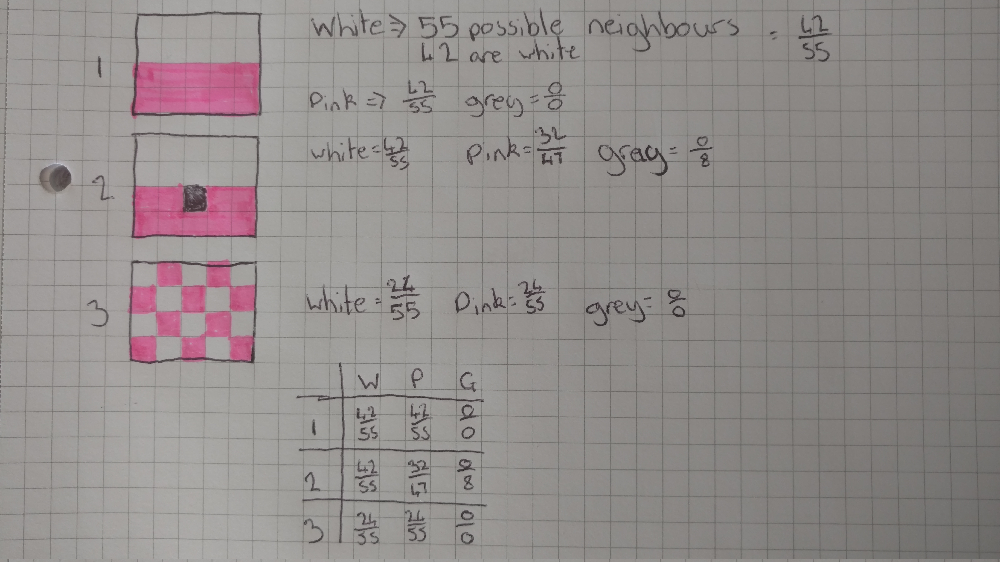

#### Texture
- Determines appearance but is hard to define
- Made of neighbourhoods of pixels rather than individual ones
- Attributes:
  - Directionally
  - Periodicity
  - Randomness


#### Shape
Divide image into 4x4 blocks.
Check block for predefined edge patterns (horizontal, vertical, &plusmn;45<sup>&deg;</sup>

##### Patterns:
```brainfuck
++++ ++++ ++++
---- ++++ ++++
---- ---- ++++
---- ---- ----

---+ --++ -+++
---+ --++ -+++
---+ --++ -+++
---+ --++ -+++

--++ -+++ ++++ ++++
---+ --++ -+++ ++++
---- ---+ --++ -+++
---- ---- ---+ --++

---- ---- ---+ --++
---- ---+ --++ -+++
---+ --++ -+++ ++++
--++ -+++ ++++ ++++
```
Build a 14x1 histogram.
Compare histogram intersections.

### Image moments
(not color moments)

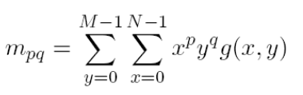

- 0-order moment -> mass
- 1-order moment -> center of gravity
- 2-order moment -> orientation
<br>
- Moments can be used to reconstruct the original image
- Can be used as low dimensional image features
- Describe asymmetries, shape features, etc

#### Invariant Moments

##### Central Moments
##### Normalized central moments
##### (Hu's) moments invariants
- Algebraic combination of central moment
- Invariant to translation, scale and rotation

##### (Maitra's) moment invariants
- Combination of Hu moments
- Invariant to contrast, scale, rotation and translation

### Combining multiple features
Querying for images based off of a single feature is often insufficient.
Color histograms, LBP histograms and edge histograms can be combined by summing each intersection score.

Applying weights we can add emphasis to certain features.

```javascript
score = (0.5  * color score) +
        (0.25 * texture score) +
        (0.25 * shape score)
```

Since features can be of different types they can have different magnitudes. Simple distances like L1, L2 would get biased by bigger values.
We need to normalize the features to make them equal (and thus comparable).

- subtract mean => similar magnitudes
- divide by S.D => similar distribution

or use appropriate distance measure such as Mahalanobis distance.

### Video Retrieval
Indexing every frame of a video is not feasible.
Taking every n-th frame is also ineffective.

Videos need to be segmented based on content i.e based on shots.
- Hard cut = instantaneous transition
- Soft cut = animated transition such as fade, disolve, wipe

#### Shot cut detection

#### Relevance Feedback

Retrieval using features and similarity measures not perfect. Include users in the loop.

1. User is presented with initial retrieval.
2. Results then interactively refined.
3. User specifies whether images are relevant until results are acceptable.

A weighted intersection is used.
During feedback, weights associated with positive features are increased and weights associated with incorrectly retrieved images are decreased.

### Image Classification

- Segment image to extract regions
- regions associated with words
- statistical modelling is needed to derive probability models for individual regions


## Topic 5 - Image database visualization and browsing

[PDF](http://learn.lboro.ac.uk/pluginfile.php/481561/mod_resource/content/7/COC202_1718_lect_05.pdf)

### Image database browsing

- Query by example (QBE)
	- Query by image content (QBIC)
	- Feature vector of query image produced and compared to feature vectors in DB.
- query by sketch (QBS)
	- similar to QBE except features extracted from a sketch provided by the user.
- query by keyword
	- requires annotation, either manual or automatic

Query by X has problems:
- needs a query
	- image (why search if you have one?)
	- sketch (try drawing "wind")
	- keyword (not precise, time consuming to label)
- What if your idea of what your searching for isnt refined
- CBIR systems are black boxes
- Results not always superb
- Most images arent returned to user
	- only the best ones?
	- content of whole DB remains unknown

Solution: Browsable image collections
- visual overview of the complete image database
- users can interactively browse
- no query needed
- helps bridge semantic gap
- browsing is fairly intuitive
	-	users dont need to learn how to form a query

> Traditionally image browsers display contents in a linear fashion
> sorted by date :O
> This is hard to browse

There are 2 main tasks:
- Visualisation
	- image arrangement
	- where to place images on screen
	- definition of visualisation space
- Navigation
	- the actual browsing
	- interactivity
	- partly constrained by visualisation method

### Mapping based visualisation
- High-dimensional CBIR feature vectors
- visualise in low-dimensional space (2 or 3)
- need to get from high-dimensional space to low dimensional space so the relations are preserved
	- similar images should be close to each other in visualisation

#### PCA (Principal component analysis)
- Karhunen-Loeve transform (KLT), Hotelling transform, ...
- Orthogonal transformation to convert data into a new space
	- Decorrelate data
	- Capture maximum variance in fewest components
- Useful for:
	- "Better" representation of data.
	- Discovering patterns in (high-dimensional) data.
	- Dimensionality reduction
	- Feature reduction, compression
	- visualisation

##### <review-of-basic-stuff&gt;

- **Covariance**
	- operates on two vars `cov(X, Y)`
	- indication of how one variable is related to another
	- variance is a special case of covariance `var(X) = cov(X, X)`
- Covariance matrix:
	- 
	```bash
	    | var(X)    cov(X, Y) cov(X, Z) |
	C = | cov(Y, X) var(Y)    cov(Y, Z) |
	    | cov(Z, X) cov(Z, Y) var(Z)    |
	```
- Eigenvectors
	- Eigenvector of a (square) matrix: vector that when multiplied by the matrix gives a scaling of the vector
	- can normalize (to unit length)
	- 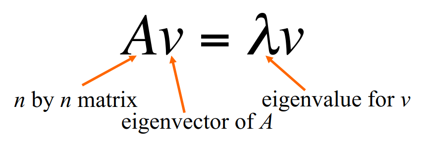
	- 
	- for an NxN matix we can compute N eigenvectors
	- eigenvectors are othogonal
		- orthonormal for unit length eigenvectors
	- can be calculated by an iterative process
		-	in matlab it is done with the `eig()` method
> **orthonormal** *adjective* - both orthogonal and normalized.

**</review-of-basic-stuff&gt;**

##### Procedure
1. calculate covariance matrix of data
2. compute eigenvectors of the covariance matrix
3. sort eigenvectors by corresponding eigenvalues
	-	sorts the vectors by importance
	- captured variance given by eigenvalues
	- **sorted eigenvectors = principal components (PCs)**
4. Project data onto space spanned by PCs
	- matrix containing eigenvectors can be used as projection matrix
	- multiplication with data matrix

##### Usage
- Data projected into new space spanned by PCs.
	- PCs are weighted sums of original data axis.
- Projection itself is lossless
	- Data has same dimensionality
	- can be fully recovered through inverse transform
- we can also project into a lower-dimensional space
	-	space spanned by k PCs with largest eigenvalues
	- captures most important information
	- other data can be discared without losing much infomation
	- reconstructed data close to original.

> Slide 22 shows a flow chart of doing/using PCA

##### For Feature Reduction
- High-dimensional features for classification, retieval, etc
<br />
- run PCA on data.
- select k PCs to define new feature space.
- project data into new space.
	- co-ordinates/weights in new space = new (reduced) features
- Use new features for classification, retieval, etc.
<br />
- Often gives comparable or possibly even better results than original features.

##### For (facial) recognition
- Normalised face images treated as data vectors
- run PCA on that data
	-	pick k PCs = eigenfaces
- Face represented by co-ordinates/weights in new space.
- Face recognition e.g by finding closest face in new space (Euclidean distance)

##### For image database visualisation
- Images represented by high-dimensional feature vectors
- perform PCA on image feature data.
- take first 2 (or 3) principal components to define visualisation space.
- Project feature vectors into low-dimensional space
- plot image thumbnails at calculated co-ordinates
- similar images will get projected to similar locations

----------------------

#### MDS (Multi-dimensional scaling)
- Projection to lower dimensional space.
- attempts to best preserve the original distances
- based on pair-wise distances between samples
	- square (triangular) matrix
	- can use any kind of distances
	- no need for actual data vectors
- intial configuration
	- e.g through PCA
<br />
- Iterativly change configuration to better fit the data
	- minimise stress
- MDS will allow for more accurate representation
	- Inherently similarity/distance based
	- Allows for other distances than L<sub>2</sub>
- But also is slower

##### For image database visualisation
- Obtain distances between images (from feature vectors or otherwise)
- Decide on dimensionality of projections (typically 2)
- generate initial configuration
- perform MDS
- plot image thumbnails at calculated co-ordinates
<br />
Similar images will get projected to similar locations

----------------------

### Clustering-based visualisation
- similar images are grouped together
- groups can be summarised by representative images.
<br />

- Content-based
  - using CBIR features of the images
- Metadata-based
  - Uses keywords
	- filenames
	- etc
- Time-based
	- Using image creation date

#### K-Means
##### For image segmentation
- divide an image up into different regions corresponding to objects.
	-	its hard
	- many techniques
- K-means clustering can be used
	- select k (not easy)
	- **samples = pixels**
	- data for each sample = intensity (greyscale) or RGB (color)
	- run k-means using that data
	- "Divide" image according to clusters


### Heiarchical clustering for image browsing
- Hierarchical clustering
	- iterative merging of two most similar clusters to form new cluster
		- until only 1 cluster remains
	- retain old clusters
- Through clusting, a tree structure is obtained
	- Used for navigation
	- representative images for cluster

----------------------

#### Dealing with overlap
> Slide 27-28
Positions generated for image visualisation will often lead to images overlapping one another. Images can be partly or totally occluded. The solution is to move the images, possibly arrange into a grid.

- Fill empty cells on grid by moving cells across from neighbouring cells.
- Place - bump - double bump
	-	place: into empty neighbouring cell
	- bump: neighboring image into 2nd ring them bump

----------------------

### Graph-based visualisation

Arrange images into a graph structure
- Nodes = images
- Edges based on shared annotation / image similarity

<br/>

- Visualisation - mass-spring models
	- edges modelled as springs
	- rest length based on edge weight/strength
	- find stable layout (set of differential equations)
----------------------

### Browsing

- Visualisation on its own is useful but not too much
- Navigation through visualised image database
- Interactivity and intuitive operations crucial

#### Horizontal browsing
- Navigation within a single screen of visualised images
- This type of browsing is often useful when an image database has been visualised through a mapping or graph-based scheme, or a visualisation of a single cluster of images.

##### Panning
If the entire visualised image collection cannot be displated simultaneously on a screen, a panning function is required in order to move around the visualisation.

##### Zooming
If many images are on a single 2D plane, will be too small to distinguish.

Useful to have a facility to zoom into an area of interest.

##### Magnification
Although similar to zooming, magnification usally occurs when a cursor is placed over an image
> true madness

Fisheye lens distorts images around cursor.

#### Vertical browsing
In visualisation approaches based on a hierarchical structure, images can be navigated using vertical browsing.

Clusters of images are typically visualised through use of representative images.

These images are cruscial for vertical browsing as these are typically the reason for which a vertical browsing step into the next level of the hierarchy is initiated.

As a result, images belonging to the cluster but not shown previously, are presented to the user

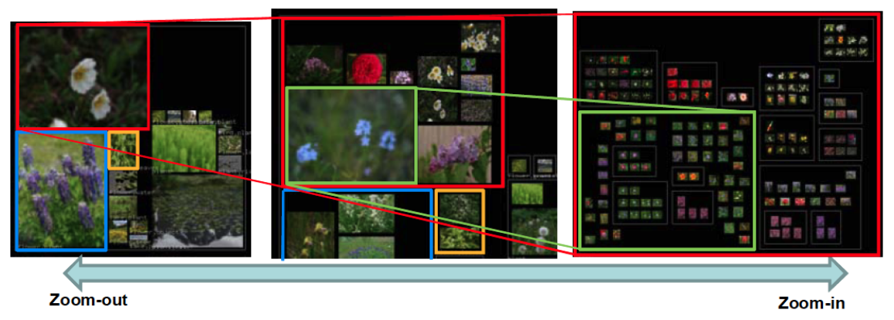

#### Graph-based browsing
Operations such as panning and zooming can in general be applied to graph-based visualisations.

In addition navigation can be performed following the edges that connect images.

#### Time-based browsing

Time stamp infomation attached to images can be used to arrange and visualise image collections.
Clearly if a collection is visualised based on temporal concepts, browsing should also be possible based on time.
Often clustering-based, using representative images for clusters that correspond to certain time periods.

----------------------

### A Browsing Application
**Hue sphere image browser**

> Slides 54-65

Attribute extraction:
- extract median colour
- hue and lightness (between 0 and 360 degs. It uses cos)

These values are used as x, and y values respectivly.
All images from DB are mapped onto a globe.
Visualisation space not optimally used.

**Heirachical hue sphere** arranges images into a grid on a sphere. This means the space is better utilised.

### Evaluation of image browsing systems
- How do we know whether an image browsing system is useful and effective not just awesome looking?
- How do we know that it will facilitate work?!
- Given two browsers how do you determine which is better

#### Target Search
- Give user an allocated time to search for a specific image.
	- also applicabale to traditional CBIR approaches
	- can compare browsing vs retrieval
- Simplest to conduct
	-	most common test
- Can be aceraged for a set of queries
- Lower time suggests better usability
- Number of time-outs and number of incorrect results can also be measured
- distinctiveness of an image (how similar it is to all other images) can affect retieval performce.

#### Category search
- give user an example image or keyword and ask user to locate N semantically relevant images from the system.
- similar to target search but does not have to be exhaustive
	- More than N matches in DB
- Relatively simple to conduct
- Time taken to select images, time-outs and the error rate can be measured (errors calculated by consulting pre-defined ground-truth)
- Can also investigate how user arrived at the N images.
	- images vs time

#### Journalistic task
- commmon use of image retrieval systems for journalistic purposes are "searches to illustrate a document"
- User given an article of text and asked to illustrate
- In essence, a variant of a category search.
- Time taken and relevance of retievd images can be measured

#### Annotation task
- Task is for user to annotate a dataset.
- image browsing systems useful to aid annotation
- rivh set of measurements can be extracted from the task including number of interactions, error rate and time taken.
- Can be measure in principle for any system
	- if annotation function has been added
- In essence, very similar to category search.

#### User opinion
- Users are asked to complete a questionnaire in order to gauge their opinion on the system and/or aspects of the user interface
- Should be implemented in conjunction with another more objective task
- Questionnaires can be analysed statistically
- Can be useful in gaining insights into usefulness of different aspects of the system, which may lead to improved appraches.


### Summary
- Image browsers provide an alternative to retrieval-based approaches
- visualisation/browsing by visual similarity
- Mapping-based - Clustering-based - graph-based.
- PCA (not only) for visualisation
- Clustering (not only) for visualisation
- Browsing: horizontal - vertical
- A sample image browsing application: hue sphere image browser.


----------------------


## Topic 6 - Colour consistancy and colour invariance

### Adding Colour
- Light can be split into colours
- Colours can be added together

Our retinas percieve colour using cones. We have red, green and blue cones.

### Colour based image retrieval (Uses QBE)
1. A colour histogram can be created for each image in a database, where the colour histogram is equal to the index that each image is saved under.
2. A query image is input and a colour histogram is created for that image. The histogram intersection between the query image and all images in the database are compared.
3. Rank images bu intersection score
4. Show top results to user

#### Advantages of colour indexing
- Simple technique
- Good retrieval performance
- Not affected by rotations or translations
- Robust to occlusion

### Colour image formation
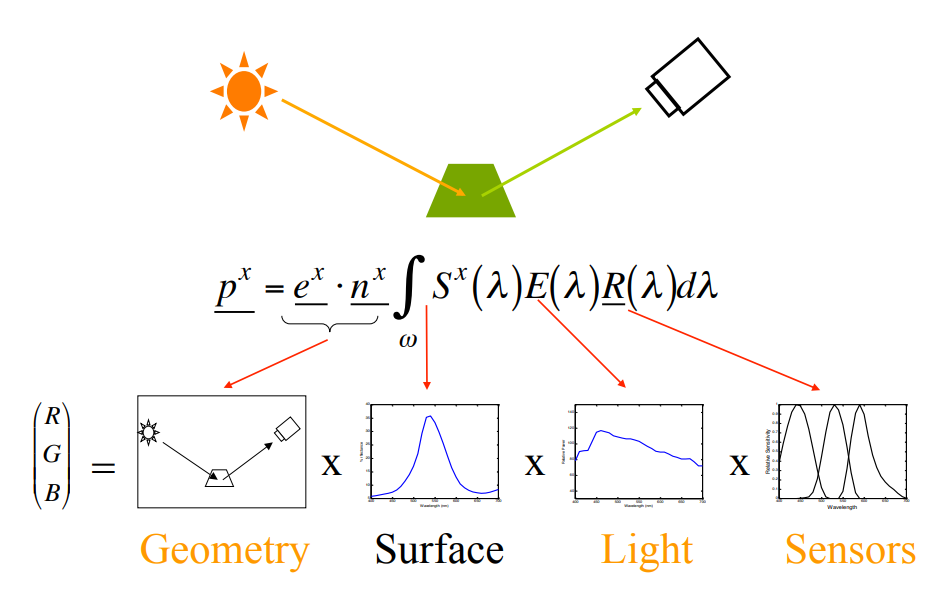

>**Chromaticity** - An objective specification of the quality of a color regardless of its luminance.

#### Chromaticity space
- Ignores intensity information
- Invariant to imaging geometry
- Invariant to shading

#### Illuminants
Image colour changes depending on illuminant


Illumination change can be modelled with a relatively simple model.
Two images are a linear transformation away if:
I<sub>1</sub> = I<sub>2</sub>*T
or if using the diagonanl model:
I<sub>1</sub> = I<sub>2</sub>*D
where:
I<sub>1</sub> = 1D matrix (R<sub>1</sub>, G<sub>2</sub>, B<sub>3</sub>)
& I2 = 1D matrix (aR<sub>1</sub>, bG<sub>2</sub>, gB<sub>3</sub>)

#### Computational colour constancy
Is the estimation of the illuminant colour and can be used to colour correct images.
There are two main approaches:
- Statistical colour constancy algorithms:
	+ e.g. Greyworld, maxRGB
	+ Correlate the statistics of colours in an image with statistical knowledge about lights and surfaces.
	+ works well if there are many surfaces in the scene
	+ only works for a limited colour diversity
- Physics-based colour constancy algorithms:
	+ e.g. Dichromatic colour constancy
	+ Based on understanding on how physical processes manifest themselves in images. e.g. shadows, interreflections
	+ can give a solution even if there are very few surfaces in a scene.
	+ Difficult to make work outside the lab

##### Greyworld colour constancy
Assumes the mean of each image is the same(grey).
alpha = mean(R)
beta = mean(G)
gamma = mean(B)
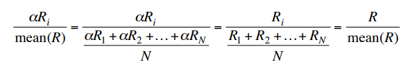

##### MaxRGB colour constancy
Also known as white patch retinex.
Assumes that the brightest patch in the scene is a white patch.
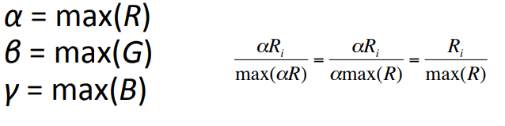

##### Dichromatic reflection model
*Note:* I don't really know what this means
- Valid for inhomogeneous dielects: -paints plastics, papers, textiles etc
- States that the reflected light from an object has two parts:
	+ body reflection
	+ interface reflection
- both parts are comprised of:
	+ spectral power distribution of the respective reflectance
	+ geometry depending scale factor

##### Matte, Lambertian or Body reflectance
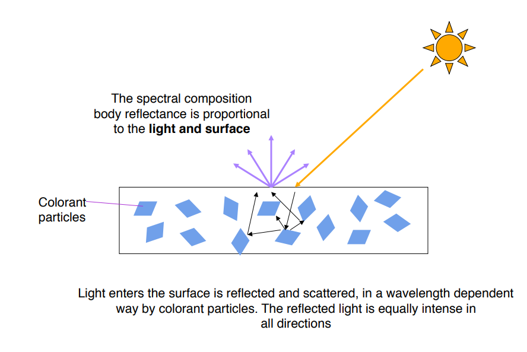

##### Highlight, specular or interface reflectance


##### Dichromatic reflectance
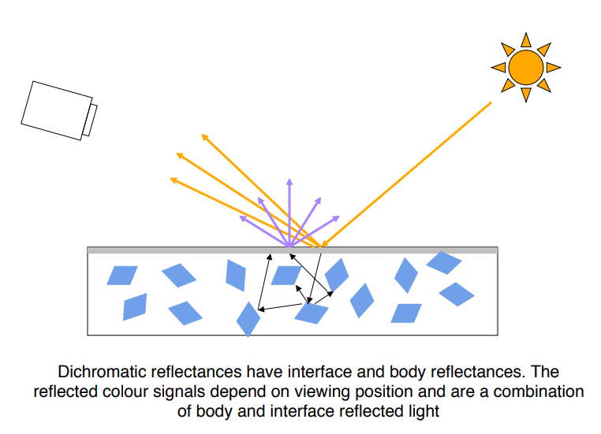

> TODO: need to add ntoes on slides 27-32

#### Normalisation
- Normalisations maintain image structure
- Features that do not change with change of light
- Scalars α,β and γ cancel
- Normalisations have been shown to work well for image retrieval under varying viewing conditions
	+ better than colour constancy algorithms

- From many normalisation methods we can produce an actual output image.
- output images of the same catured object should look similar.
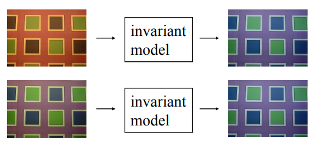
- Output images can be used in further analysis. e.g. texture analysis

##### Greyworld normalisation
Normalising by mean gives illuminant invariant descriptors
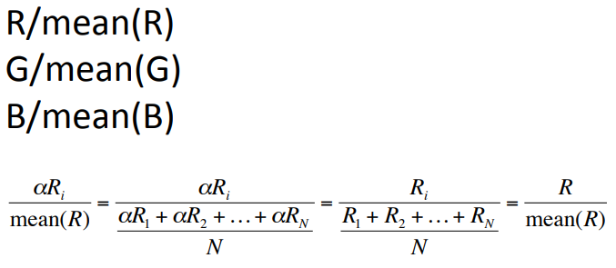

##### MaxRGB normalisation
Normalising by the brightest colour (the max RGB response) gives the illuminant invariant descriptors.


##### Colour constant colour indexing
Ratios of colours are constant across illumination change.
Calculating at each pixel colour ratios to its surround gives illumination invariant descriptors.


##### Comprehensive normalisation
Chromaticities are invariant to the geometry.
Similarly we can find descriptos that are invariant to illumination colour:
– R/ΣR
– G/ΣG
– B/ΣB (Greyworld)
By iterating and alternatively performing the two we get invariance both illumination and geometry

#### Linear vs non-linear devices
Image formation equation (physics) is linear.
But in reality images are in general not linear.
Linear images are hard to obtain
Most linear images are not desirable
	+ Monitor gamma
	+ contrast enhancement - we want to make images look good
Models of illumination change hold only for linear devices
Colour invariants rely on linear model

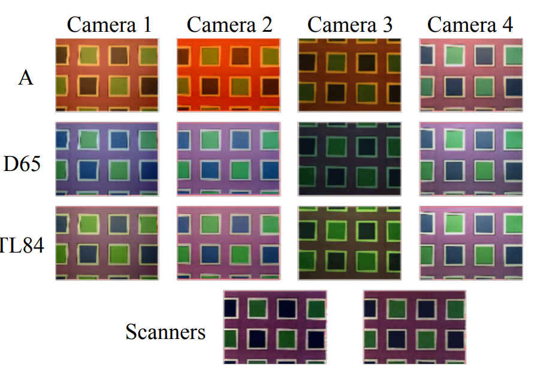
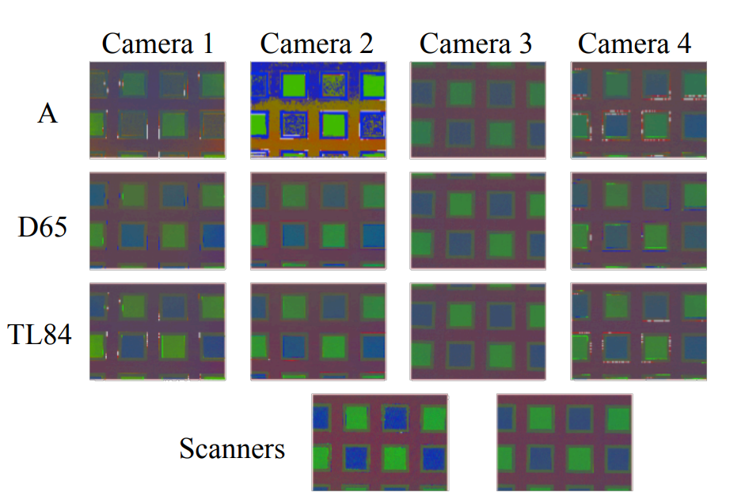

#### Ranking preserving invariants
- If object 1 under light A is more red than object 2 then it will also appear more red under light B.
- This relationship will also hold for images that underwent a non-linear monotonic transform(such as a contrast change)
- The ranking between RGBs is preserved
- Invariants that preserve the ranking of RGB values should prove useful for invariant image retrieval

### Histogram Equalisation
- Typically used as a contrast enhancing technique
- It modifies the histogram so that is is approxiamtely uniform
- Histogram equalisation is a simple yet powerful colour invariant
- equalisation preserves the ranking
- apply histogram equalisation to eah channel seperately
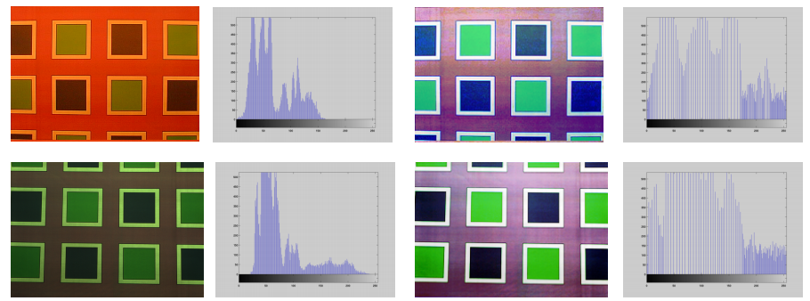
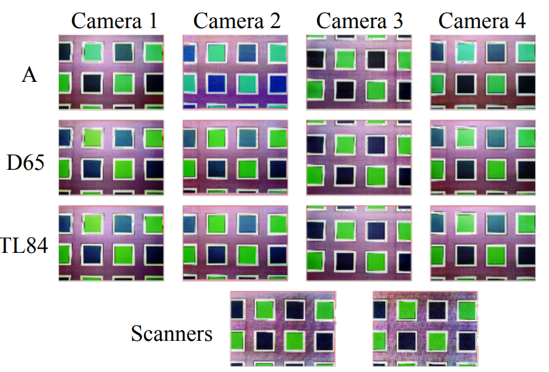

#### Gamma and brightness affect colours
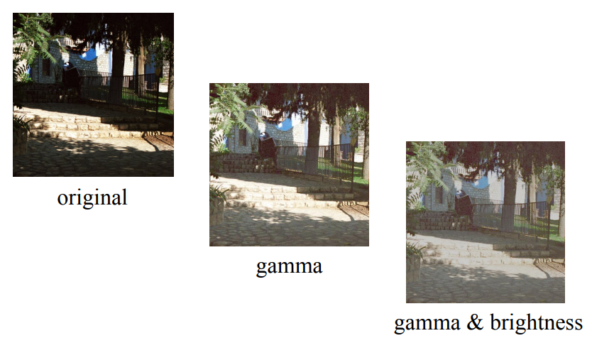

#### The problem with linear images
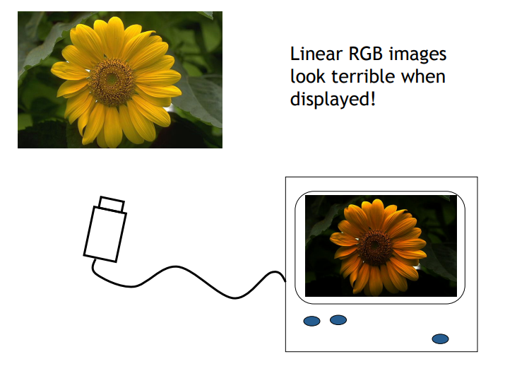

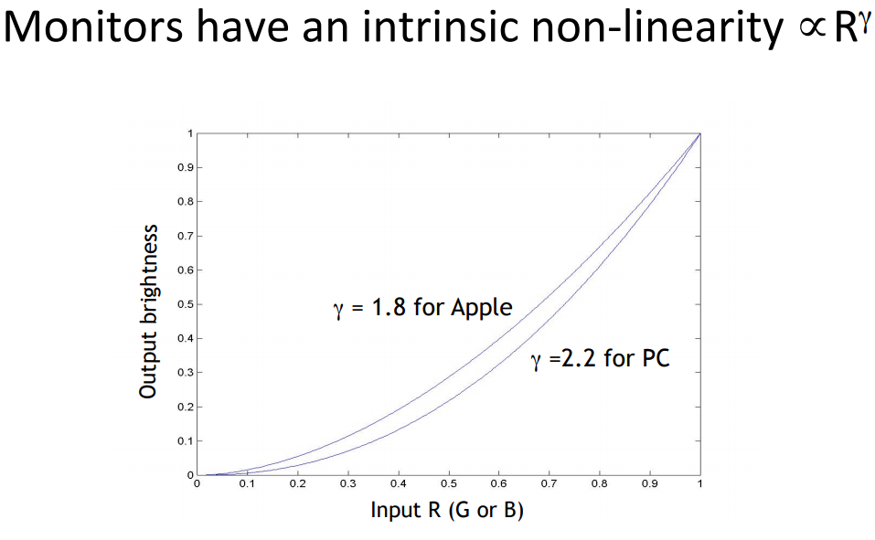

#### Correcting images for display
If the monitor applies a power of gamma, the reciprocal of gamma must be applied to linearise the RGBs:
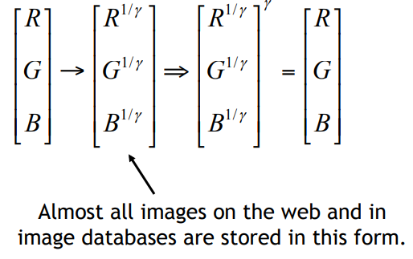

#### Displaying correctd images
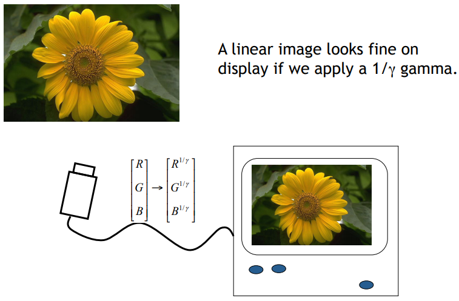

#### Enhancing Images
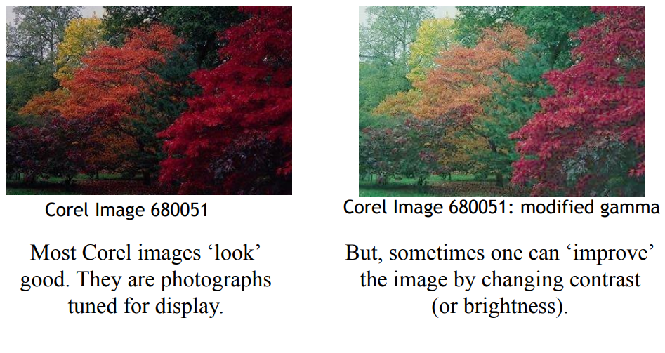
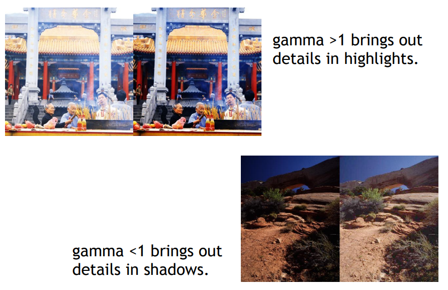

#### Brightness
Brighness changes the overall magnitude of each RGB. It applies a linear compression/expansion to all pixels equally:
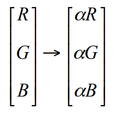

### Summary of Brightness and Gamma
1) Altering brightness and gamma changes the colour of images (colour is not an absolute cue).
2) Colour has 3 degrees of freedom. One should be independent of brightness/gamma
3) We might ask what stays the same as we change the brightness and gamma? (Answer: the hue?)
4) We might expect if we cancel brightness and gamma that we arrive at a huw correlate.

### Hue in HSV, IHS, HLS
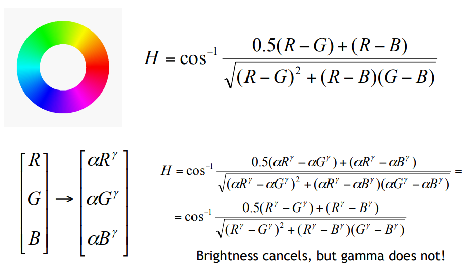

### An invariant to brightness and gamma
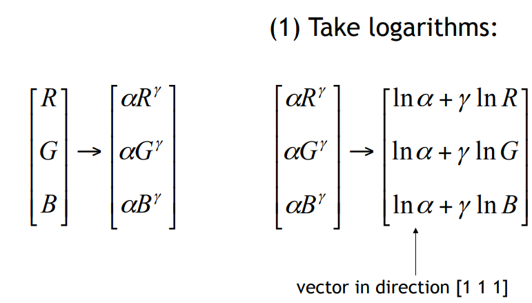
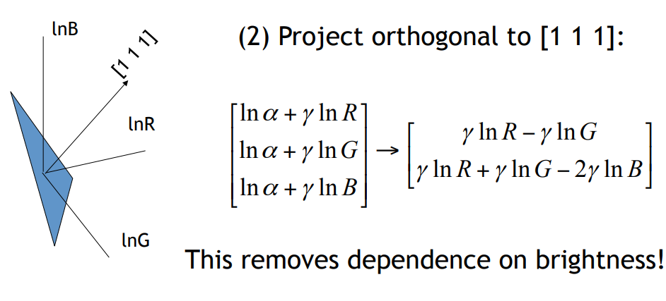
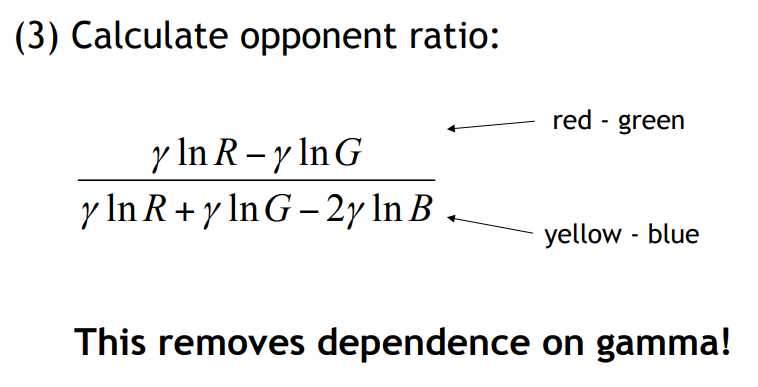
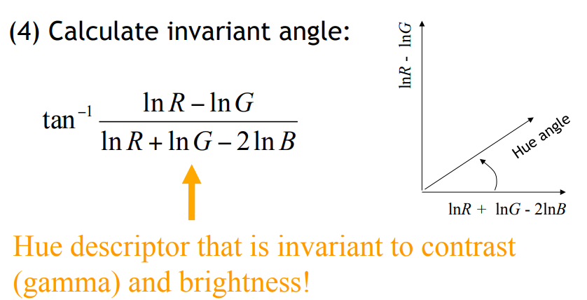

### Summary
- Image colours are affected by a variety of confounding factors
	+ image geometry, illumination, devices
- Images are further affected by manipulation
	+ brightness and gamma
- All these changes will cause problems for colour based algorithms
- We can devise algorithms to "get rid" of these effects.
	+ Colour constancy: estimate illuminant colour(and correct image)
		+ statistical: greyworld, maxrgb
		+ physics-based: dichromatic colour constancy
	+ Colour invariants: not affected by changes
		+ Greyworld, MaxRGB
		+ Colour rations, comprehensive normalisation
		+ Histogram equalisation
		+ Gamma/brightness invariant hue

----------------------

## Topic 8 - Image compression
[PDF](http://learn.lboro.ac.uk/pluginfile.php/488397/mod_resource/content/8/COC202_1718_lect_08.pdf)


### Differential coding
We store the difference to the previous values.

```javascript
Before: 212 211 211 215 214 214 214 214
After:  +212 -1 +0 +4 -1 +0 +0 +0
```

This doesn't actually compress the image.
Since values can be both positive and negative it actually double the number of bits needed as now we need the range off -255 to 255.

However, images typically change slowly and so most of the differences will be small.
We can apply further compression.

### PNG - predictive coding
Extends the previously mentioned differential coding.
PNG looks at previous neighboring pixels and predicts the current pixel (left and up, scan left-to-right, top-to-bottom).

- Simple differential coding, the prediction is the immediate left neighbor.
- More neighbors typically leads to better prediction

The differences between the predictions and the actual values are then coded.

```javascript
-----------
| | | | | |
| |C|B|D| |
| |A|x| | |
| | | | | |
-----------
```
For the pixel X we store the type and the difference to the predicted value

| Type | Name    | Predicted value
|------|---------|-
| 0  	 | None    | Zero (the raw byre passes unaltered)
| 1 	 | Sub     | Byte A (to the left)
| 2 	 | Up      | Byte B (above)
| 3    | Average | Mean of A and B rounded down
| 4    | Paeth   | A, B, or C, whichever is closest to p=A+B-C

The result is a stream of predictor types and differences.
This stream is compressed with the **DEFLATE** algorithm.

**DEFLATE** is a combination of:
- Entropy coding (Huffman coding)
- Duplicate string elimination
	- LZ77 compression algorithm
	- look for duplicate sets of bytes; instead of storing them again store a back-reference to the already coded ones.

### JPEG compression

#### Entropy Compression
- DC values are differentially coded (difference to previous DC value).
- These differences are stored as two components:
	- the DC code which states how many bits are going to follow (different ranges of differences)
	- the actual DC difference (within the range)
- The DC codes are entropy coded using Huffman.
	- A standard huffman table is supplied by the JPEG group, but this can be optimised.

> JPEG table shown on slide 35.
> 36 contains an example of compressing a value with the table.

- AC coefficients are stored in a zig-zag fashion.
- coefficients towards the lower right are more likely to be 0s after quantisation
- storing coefficients in this order increases the likelihood of having long runs of 0s
<br/>
- two components for each non-zero AC coefficient:
	- the number of preceding zeros followed by the size of the AC value.
	  - The combination of these two is Huffman encoded using a separate Huffman table for AC values which has up to 250 possible values.
	  - These are special Huffman codes that allow early termination of a block (i.e all remaining ACs=0)
	- The data for the actual AC value


#### Summary
1. Convert image into YCbCr
2. downsample CbCr channels (optional)
3. chunk image into 8x8 blocks (each channel separately)
4. apply DCT on each block
5. Quantise DCT coefficients using the quantisation tables and the chosen quality factor
6. Differental coding of DC data followed by Huffman coding
7. Runlength coding of AC data followed by Huffman coding

#### Compression vs Retieval
- Images must be compressed due to limited disk space
- Most CBIR techniques operate in the uncompressed pixel domain
- during the query images need to be decompressed
- feature vectors are stored alongside the images

Techniques that can operate directly on compressed images are needed:
- **Midstream content access**
- more efficient
- less demanding on resources

Two possibilties:
- Algorithms that operate on pre-existing compressed formats (like JPEG)
- New compression methods which meet 'the fourth criterion'

> The fourth criterion is "4. Content access work"
> it is a measure of how much work is needed to be done to actually access the data. I think. Its all in this [Paper](http://hd.media.mit.edu/tech-reports/TR-295.ps.Z).

#### JPEG CBIR
Compressed-domain CBIR for JPEG operates on the DCT coefficients.
Meaning the huffman stuff and quantisation needs to be reversed but not the DCT.
The DCT operation is the most time consuming part.

**color histogram**
- DC component represents the average color for the entire 8x8 block of pixels
- using only DC term gives a downsampled version of the image
- this can be used to directly build a color histogram by building a histogram of DC terms

**texture descriptors**
- The AC coefficients represent the variance of pixels across the block.
- Tecture descriptors can be build directly using the first few AC coefficients.

**Edge descriptors**
- Edge information is stored from the coefficients representing vertical, horizonal, or diagonal infomation.
- thises coefficents can be directly exploted for feature calculation.

### Summary
- Compression fundamentals:
 - runlength coding
 - differential coding
 - predicitve coding
 - entropy (Huffman) coding
- PNG compression
	- lossless
	- predictive coding + entropy coding
- JPEG compression
	- lossless
	- DCT + quantisation + entropy coding
- JPEF compressed domain CBIR
	-	color - texture	- shape
