# Computer Vision


<!-- @import "[TOC]" {cmd="toc" depthFrom=1 depthTo=6 orderedList=false} -->

<!-- code_chunk_output -->

* [Computer Vision](#computer-vision)
	* [Topic 1 - Introduction and Fundamentals](#topic-1-introduction-and-fundamentals)
		* [Images](#images)
		* [Pixel Neighbourhood](#pixel-neighbourhood)
		* [Adjacency](#adjacency)
		* [Paths](#paths)
		* [Regions](#regions)
		* [Distances](#distances)
				* [D4-distance (city-block/Manhattan or L1 norm)](#dsub4sub-distance-city-blockmanhattan-or-lsub1sub-norm)
				* [D8-distance (chessboard or max norm)](#dsub8sub-distance-chessboard-or-max-norm)
		* [Image Enhancement](#image-enhancement)
			* [Digital subtraction angiography](#digital-subtraction-angiography)
	* [Topic 2 - Spatial Domain Image Processing](#topic-2-spatial-domain-image-processing)
		* [Spatial Domain Processing](#spatial-domain-processing)
		* [Graylevel transforms (intensity transformation functions)](#graylevel-transforms-intensity-transformation-functions)
		* [Changing Brightness](#changing-brightness)
		* [Image Negative](#image-negative)
		* [Linear Images](#linear-images)
			* [Gamma (power law) transformation](#gamma-power-law-transformation)
		* [Image Histograms](#image-histograms)
		* [Contrast/Histogram Stretching](#contrasthistogram-stretching)
			* [Dynamic Range](#dynamic-range)
			* [Thresholding](#thresholding)
			* [General Contrast Stretching](#general-contrast-stretching)
			* [Highlighting intensity range](#highlighting-intensity-range)
		* [Histogram Equalization](#histogram-equalization)
		* [Global vs. Local Processing](#global-vs-local-processing)
		* [Histogram Matching](#histogram-matching)
		* [Spatial Filtering](#spatial-filtering)
			* [Smoothing Filters](#smoothing-filters)
			* [Average Filter (mean filter)](#average-filter-mean-filter)
			* [Weighted Average](#weighted-average)
			* [Gaussian Filter](#gaussian-filter)
			* [Median Filter](#median-filter)
		* [Image Derivatives](#image-derivatives)
		* [Sharpening Filter - Laplacian](#sharpening-filter-laplacian)
		* [Sobel Filter](#sobel-filter)
	* [Topic 3 - Morphological Image Processing](#topic-3-morphological-image-processing)
		* [Sets](#sets)
		* [Translation](#translation)
		* [Structuring Elements](#structuring-elements)
		* [Fit](#fit)
		* [Hit](#hit)
		* [Erosion](#erosion)
		* [Dilation](#dilation)
		* [Opening](#opening)
		* [Closing](#closing)
		* [Properties of Opening and Closing](#properties-of-opening-and-closing)
		* [Morphological Boundry Extraction](#morphological-boundry-extraction)
		* [Morphological Region Filling/Hole Filling](#morphological-region-fillinghole-filling)
		* [Morphological Hit-or-Miss Transform](#morphological-hit-or-miss-transform)
		* [Morphological Corner Detection](#morphological-corner-detection)
		* [Morphological Thinning](#morphological-thinning)
	* [Topic 4 - Content­‐based image retrieval](#topic-4-contentbased-image-retrieval)
		* [Traditionally](#traditionally)
		* [Content-Based](#content-based)
			* [Color](#color)
				* [Quadratic Distance Measure](#quadratic-distance-measure)
				* [Color Moments](#color-moments)
				* [Color coherence vectors](#color-coherence-vectors)
				* [Color correlograms](#color-correlograms)
			* [Texture](#texture)
				* [Local binary patterns](#local-binary-patterns)
			* [Shape](#shape)
				* [Patterns:](#patterns)
		* [Image moments](#image-moments)
			* [Invariant Moments](#invariant-moments)
				* [Central Moments](#central-moments)
				* [Normalized central moments](#normalized-central-moments)
				* [(Hu's) moments invariants](#hus-moments-invariants)
				* [(Maitra's) moment invariants](#maitras-moment-invariants)
		* [Combining multiple features](#combining-multiple-features)
		* [Video Retrieval](#video-retrieval)
			* [Shot cut detection](#shot-cut-detection)
				* [Color histograms](#color-histograms)
			* [Key frame selection](#key-frame-selection)
		* [Semantic Gap](#semantic-gap)
			* [Relevance Feedback](#relevance-feedback)
		* [Image Classification](#image-classification)
		* [R-trees](#r-trees)
			* [Retrieval](#retrieval)
	* [Topic 5 - Image database visualization and browsing](#topic-5-image-database-visualization-and-browsing)
		* [Image databsae browsing](#image-databsae-browsing)
		* [Mapping based visualisation](#mapping-based-visualisation)
			* [PCA (Principal component analysis)](#pca-principal-component-analysis)
				* [<review-of-basic-stuff&gt;](#review-of-basic-stuffgt)
				* [Procedure](#procedure)
				* [Usage](#usage)
				* [For Feature Reduction](#for-feature-reduction)
				* [For (face) recognition](#for-face-recognition)
				* [For image database visualisation](#for-image-database-visualisation)
			* [MDS (Multi-dimensional scaling)](#mds-multi-dimensional-scaling)
				* [For image database visualisation](#for-image-database-visualisation-1)
		* [Clustering-based visualisation](#clustering-based-visualisation)
			* [K-Means](#k-means)
				* [For image segmentation](#for-image-segmentation)
		* [Heiarchical clustering for image browsing](#heiarchical-clustering-for-image-browsing)
			* [Dealing with overlap](#dealing-with-overlap)
		* [Graph-based visualisation](#graph-based-visualisation)
		* [Browsing](#browsing)
			* [Horizontal browsing](#horizontal-browsing)
				* [Panning](#panning)
				* [Zooming](#zooming)
				* [Magnification](#magnification)
			* [Vertical browsing](#vertical-browsing)
			* [Graph-based browsing](#graph-based-browsing)
			* [Time-based browsing](#time-based-browsing)
		* [A Browsing Application](#a-browsing-application)
		* [Evaluation of image browsing systems](#evaluation-of-image-browsing-systems)
			* [Target Search](#target-search)
			* [Category search](#category-search)
			* [Journalistic task](#journalistic-task)
			* [Annotation task](#annotation-task)
			* [User opinion](#user-opinion)
		* [Summary](#summary)
	* [Topic 6 - Colour consistancy and colour invariance](#topic-6-colour-consistancy-and-colour-invariance)
		* [Adding Colour](#adding-colour)
		* [Colour based image retrieval(Uses QBE)](#colour-based-image-retrievaluses-qbe)
			* [Advantages of colour indexing](#advantages-of-colour-indexing)
		* [Colour image formation](#colour-image-formation)
			* [Chromaticity space](#chromaticity-space)
			* [Illuminants](#illuminants)
			* [Computational colour constancy](#computational-colour-constancy)
				* [Greyworld colour constancy](#greyworld-colour-constancy)
				* [MaxRGB colour constancy](#maxrgb-colour-constancy)
				* [Dichromatic reflection model](#dichromatic-reflection-model)
				* [Matte, Lambertian or Body reflectance](#matte-lambertian-or-body-reflectance)
				* [Highlight, specular or interface reflectance](#highlight-specular-or-interface-reflectance)
				* [Dichromatic reflectance](#dichromatic-reflectance)
	* [Topic 7 - Texture](#topic-7-texture)
		* [Applications](#applications)
		* [Texture Measures](#texture-measures)
			* [Statistical Descriptors](#statistical-descriptors)
			* [Co-occurrence matrix](#co-occurrence-matrix)
			* [Co-occurance features](#co-occurance-features)
			* [LBP (Local binary patterns)](#lbp-local-binary-patterns)
				* [Circular LBP](#circular-lbp)
				* [Rotation Invariant LBP](#rotation-invariant-lbp)
				* [Uniform LBP](#uniform-lbp)
				* [Multi-scale LBP](#multi-scale-lbp)
				* [Multi-dimensional LBP](#multi-dimensional-lbp)
		* [Summary](#summary-1)
	* [Topic 8 - Image compression](#topic-8-image-compression)
		* [Runlength coding](#runlength-coding)
		* [Differential coding](#differential-coding)
		* [Entropy coding - Huffman coding :D](#entropy-coding-huffman-coding-d)
			* [Creating the table](#creating-the-table)
		* [PNG - predictive coding](#png-predictive-coding)
		* [JPEG compression](#jpeg-compression)
			* [Color space](#color-space)
			* [Frequency domain](#frequency-domain)
			* [DCT - Discrete Cosine Transform](#dct-discrete-cosine-transform)
				* [Examples](#examples)
			* [Quantisation](#quantisation)
			* [Entropy Compression](#entropy-compression)
			* [Summary](#summary-2)
			* [Decompression](#decompression)
			* [Compression vs Retieval](#compression-vs-retieval)
			* [JPEG CBIR](#jpeg-cbir)
		* [Summary](#summary-3)

<!-- /code_chunk_output -->

----------------------


## Topic 1 - Introduction and Fundamentals

[Week 1 - PDF](http://learn.lboro.ac.uk/mod/resource/view.php?id=298724)

### Images

**Image:** 2D function f(x,y)

**Intensity:** f() in interval [o, L-1] with L=2<sup>k</sup>
where:
```javascript
k=bitdepth
(bpp - bits-per-pixel)
```
*Note:* often bpp=8 for greyscale, bpp=24 for colour images

Number of bits required to store image: NxMxk


**Spatial Resolution:** Measure of the smallest discernible detail in an image, line pairs per unit distance, dots (pixels) per unit distance, dots per inch (dpi)

**Intensity Resolution:** Measure of the smallest discernible change in intensity level, bits per pixel (bpp), no. of graylevels

**Image Interpolation:** method to increase or decrease number of pixels in image

- Nearest neighbour interpolation: Copy value of nearest pixel
- Bilinear interpolation: calculated based on weighted average of neighbours


### Pixel Neighbourhood

4-neighbours

- Used to identify adjacent pixels
- Useful for analyzing regions, edges, etc
- Only vertical and horizontal neighbours

Diagonal neighbours

- Only neighbours along the diagonal

8-neighbours

- Considers all direct neighbours


### Adjacency

- V: set of intensity values to define adjacency.
- **4-adjacency:** pixels are adjacent if values are in V and are in 4-neighbourhood.
- **8-adjacency:** pixels are adjacent if values are in V and are in 8-neighbourhood.
- **m-adjacency:** diagonals can only be connected if there are no 4-adjacency pixels.


### Paths

A **path** is a series of distinct pixels from a pixel at `(x,y)` to another pixel at `(s,t)`.

If <code>(X<sub>0</sub>, Y<sub>0</sub>) = (X<sub>n</sub>, Y<sub>n</sub>)</code>, the path is a closed path

8-paths can result in ambiguity, can be solved using m-path

Pixels are **connected** if there is a **path** between them

### Regions

For every pixel p in S, the set of pixels in S that are connected to p is called a **connected component** of S

**Connected components** are used to define regions - a **region** R of the image I is a connected component of I

Two regions are adjacent if their union forms a connected set

Regions that are not adjacent are **disjoint**

The **boundary** of a region R is the set of pixels in the region that have one or more neighbours that are not in R

- Boundaries (usually) form closed paths

If R happens to be an entire image, then its boundary is defined as the set of pixels in the first and last rows and the columns of the image

### Distances

##### D<sub>4</sub>-distance (city-block/Manhattan or L<sub>1</sub> norm)

Sum of x and y distances

```javascript
- - 2 - -
- 2 1 2 -
2 1 0 1 2
- 2 1 2 -
- - 2 - -
```

##### D<sub>8</sub>-distance (chessboard or max norm)

Max of x and y distances

```javascript
2 2 2 2 2
2 1 1 1 2
2 1 0 1 2
2 1 1 1 2
2 2 2 2 2
```

Remember when calculating distance that diagonals require euclidean distance calculation

### Image Enhancement

Noise can be reduced by averaging many noisy images together

#### Digital subtraction angiography
This is an example of an image subtraction application.

```javascript
Enhanced image = image after injection with contrast medium - image before injection
```

----------------------

## Topic 2 - Spatial Domain Image Processing

[Week 2 - PDF](http://learn.lboro.ac.uk/mod/resource/view.php?id=301412)

### Spatial Domain Processing

```javascript
g(x, y) = T(f(x, y), N(x, y))
f(x, y): input image
g(x, y): output image
T: an operator on f() defined over a neighbourhood N(x, y) of point (x, y)
```

### Graylevel transforms (intensity transformation functions)

Operates on individual pixels' intensity values

```javascript
s = T(r)
r: original intensity
s: new intensity
```

Location independent pixel processing

- Always same value s for same value of r
- Independent of neighbourhood pixel

### Changing Brightness

```javascript
s = T(r) = c * r
c: constant
For colour images, multiply each channel by the same c
```

Global change of brightness (image gets brighter or darker)

Might lead to saturated pixels as dynamic range is limited

### Image Negative

```javascript
s = T(r) = max - r  = (L - 1) - r

// Number of greylevels
L = 1 - r // if image scaled to [0 ; 1]
```

### Linear Images

Linear image = linear relationship between intensity in captured scene and pixel value (looks terrible when displayed)

Monitor use an intrinsic non-linearity-gamma - R<sup>γ</sup>

If a monitor applies a power of gamma, the reciprocal of gamma must be applied to linearise image RGBs:

Note: images are scaled to [0;1] prior to transformation (since then the results will also be in [0 ; 1])

#### Gamma (power law) transformation

A linear image looks fine on a display if we apply a 1/γ gamma

Displays have a range of about 100 to 1 compared to a visible range of about 10000 to 1. It follows that images are 'compressed' prior to display. Compression can lead to important detail being lost (e.g. in the shadows or highlights)

Bright image: High gamma brings out details in the highlights

Dark image:   Low gamma brings out details in the shadows

### Image Histograms

An image histogram is a (vector representing the) plot of the graylevel frequencies in the image.

Divide the frequencies/counts by the total number of pixels to obtain probabilities

- Will sum to 1
- Histogram ≈ probability distribution function (PDF)

Histograms clustered and the low end correspond to **dark** images
Histograms clustered at the high end correspond to **bright** images
Histograms with a small spread typically correspond to **low contrast** images (i.e mostly dark, mostly bright, or mostly grey)
Histograms with a widespread typically correspond to **high contrast** images


### Contrast/Histogram Stretching

Piecewise linear transform based on pair of pixel mappings (r<sub>1</sub>, s<sub>1</sub>) and (r,<sub>2</sub>, s<sub>2</sub>)

> Piecewise function: a function consisting of multiple subfunctions.
> Think **batman** graph.

- Linear interpolation
<pre><code>
(0, 0) - (r<sub>1</sub>, s<sub>1</sub>)
(r<sub>1</sub>, s<sub>1</sub>) - (r,<sub>2</sub>, s<sub>2</sub>)
(r<sub>2</sub>, s<sub>2</sub>) - (max, max)
</code></pre>

#### Dynamic Range

- **Input**: limited dynamic range  -  <code>(r<sub>1</sub> ; r<sub>2</sub>) r<sub>1</sub> >=0, r<sub>2</sub> <= L</code>

- **Output**: full dynamic range  -  [0;L]

#### Thresholding

Special case of histogram stretching.

**Output**: binary image

- pixels below threshold -> 0
- pixels above threshold -> 1


#### General Contrast Stretching
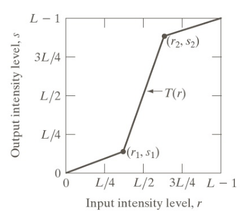

#### Highlighting intensity range

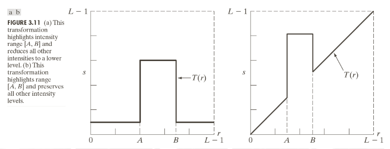

### Histogram Equalization

Contrast stretching is simple but does not always give ideal results.

High-contrast image characterized by:

- wide spread of histogram
- relatively "flat" histogram

Main idea of histogram equalization is to redistribute the grey-level values uniformly.

Number of pixels in image: n

Number of pixels in image with intensity k: n<sub>k</sub>

Probability of occurrence of gay level k in the image is p(k) = n<sub>k</sub> / n

Cumulative histogram/cumulative distribution function (CDF): CDF(k) = ∑ p(k) = ∑ n<sub>j</sub> / n

Transformation function: T(k) = (L - 1)CDF(k) = (L - 1) ∑ P<sub>r</sub>(r<sub>j</sub>) = (L - 1) ∑ n<sub>j</sub> / n

E.g
```
2 3 3 2
4 2 4 3
3 2 3 5
2 4 2 4

-4x4 Image
-intensity range [0, L - 1] = [0, 9]
```
|                           | | |    |     |     |     |     |     |     |     |
|---------------------------|-|-|----|-----|-----|-----|-----|-----|-----|-----|
| intensity k               |0|1|2   |3    |4    |5    |6    |7    |8    |9    |
| # of pixels n<sub>k</sub> |0|0|6   |5    |4    |1    |0    |0    |0    |0    |
| ∑ n<sub>j</sub>           |0|0|6   |11   |15   |16   |16   |16   |16   |16   |
| CDF(k)                    |0|0|6/16|11/16|15/16|16/16|16/16|16/16|16/16|16/16|
| (L - 1)CDF(k)             |0|0|3.3 |6.1  |8.4  |9    |9    |9    |9    |9    |
| Rounding                  |0|0|3   |6    |8    |9    |9    |9    |9    |9    |

Mapping:

    0 -> 0      3 6 6 3
    1 -> 0      8 3 8 6
    2 -> 3      6 3 6 9
    3 -> 6      3 8 3 8
    4 -> 8
    5 -> 9
    6 -> 9
    7 -> 9
    8 -> 9
    9 -> 9

### Global vs. Local Processing

Global histogram equalization modifies the complete image with the resulting mapping of intensities being the same of all pixels in the image.

Processing can also be conducted on local scale, affecting a subset (region) of the image

A neighbourhood (usually either square or circular in shape) is defined with its centre being moved from pixel to pixel

At each pixel location, the histogram of the points in the neighbourhood is computed and histogram equalization performed to identify the mapping **for that pixel only**

### Histogram Matching

Histogram equalization is a special case of histogram specification/histogram matching

**Histogram matching:** transform a given histogram/image so the resultant histogram matches (as close as possible) a target histogram/ histogram of a given image

- Histogram equalisation: `target histogram = flat histogram`

Calculate CDF<sub>1</sub> of image 1 (source image)

Calculate CDF<sub>2</sub> of image 2 (target image)

For each greylevel G<sub>1</sub> in image 1: Find greylevel G<sub>2</sub> so that:

CDF<sub>1</sub> (G<sub>1</sub>) = CDF<sub>2</sub> (G<sub>2</sub>) (look for closest match)

Identified greylevel then gives the mapping: G<sub>1</sub> -> G<sub>2</sub>

### Spatial Filtering

#### Smoothing Filters

- "Smooths" the image
- Used for blurring and noise reduction
- Used in preprocessing for:
    - removal of small details from an image (e.g prior to object extraction)
    - bridging of small gaps in lines or curves
    - reducing the effect of image noise

#### Average Filter (mean filter)

- Output = average of pixels contained in the neighbourhood of the filter mask
```javascript
        1   1   1
1/9  x  1   1   1
        1   1   1
```

#### Weighted Average
- Reduces the effect of blurring
- Different weights assigned to the coefficients in the kernel
- centre pixel most important (should be preserved)

```javascript
         1   2   1
1/16  *  2   4   2
         1   2   1
```
#### Gaussian Filter

- Useful for smoothing images (better than mean filtering)
- `g(x, y) = e ^ (-(x^2 + Y^2)/2σ^2)`

```javascript
            1  4   7   4   1
            4  16  26  16  4
1/273  x    7  26  41  26  7
            4  16  26  16  4
            1  4   7   4   1
```

#### Median Filter

- Non-linear filter that replaces the value of a pixel with the **median** of the values in the mask of the filter
- Useful for removing/reducing certain types of random noise (impulse noise, random occurrences of black and white pixels, salt and pepper noise)
- Will lead to less blurring compared to averaging

### Image Derivatives

First-order derivative of a one-dimensional function:

∂f/∂x = f(x + 1) - f(x)

Second-order derivative of a one-dimensional function:

∂<sup>2</sup>f/∂x<sup>2</sup> = f(x + 1) + f(x - 1) - 2f(x)

Same for image - along one (x) dimension:

∂f/∂y = f(y + 1) - f(y)

∂<sup>2</sup>f/∂y<sup>2</sup> = f(y + 1) + f(y - 1) - 2f(y)

- First-order derivative describes gradual transitions
- Second-order derivative describes sharp transitions (edges)
- Second-order derivatives enhances fine detail more that first-order
- Second-order zero-crossings indicate edges

### Sharpening Filter - Laplacian

Laplacian Filter derivation - Week 2 - Slide 60

<code>∇<sup>2</sup>f = f(x + 1, y) +f(x - 1, y) + f(x, y + 1) + f(x, y - 1) - 4f(x, y)</code>

Resulting Laplacian Filter:
```javascript
0   1   0
1  -4   1
0   1   0
```

Taking into account diagonal neighbours:

```javascript
1   1   1
1  -8   1
1   1   1
```
- Filtered image highlights intensity discontinuities; "flat" for constant or slowly varying intensity
- Can be used to identify edges

**Laplacian for Sharpening:**

Output is low (negative) for edges and other abrupt changes, can be used to sharpen images
Idea: emphasise pixels identified by Laplacian (edges etc)

- Sharpened image = Original image - Laplacian Image
- Sharpening Filter:

```
 0  -1   0      0   0   0       0   1   0
-1   5  -1  =   0   1   0   -   1  -4   1
 0  -1   0      0   0   0       0   1   0
```

**Unsharp Masking:**

Idea: Sharpen an image by obtaining image details through subtracting a smoothed (unsharp) version of the original image from the original

Steps:
- Blur original (e.g Gaussian filter)
- Subtract blurred from original to get mask
- Add mask to original

### Sobel Filter
Z<sub>1</sub>   Z<sub>1</sub>   Z<sub>1</sub>

Z<sub>4</sub>   Z<sub>5</sub>   Z<sub>6</sub>

Z<sub>7</sub>   Z<sub>8</sub>   Z<sub>9</sub>

M(x, y) ≈ | (z<sub>7</sub> + 2 z<sub>8</sub> + z<sub>9</sub>) - (z<sub>1</sub> + 2 z<sub>2</sub> + z<sub>3</sub>) | + | (z<sub>3</sub> + 2 z<sub>6</sub> + z<sub>9</sub>) - (z<sub>1</sub> + 2 z<sub>4</sub> + z<sub>7</sub>) |

    - Useful for detecting edges

    -1  -2  -1
     0   0   0  G_y - Horizontal edges
     1   2   1

    -1   0   1
    -2   0   2  G_x - Vertical edges
    -1   0   1

----------------------

## Topic 3 - Morphological Image Processing
[Week 3 - PDF](http://learn.lboro.ac.uk/mod/resource/view.php?id=303244)

Morphology: branch of biology that deals with the form and structure of animals and plants

Mathematical morphology of images - form, structure, image regions + characteristics/relations

Morphological image processing:

- used for pre/post-processing (cleaning/smoothing)
- for simple image analysis (corner/pattern detection, boundary extraction, thinning, etc)
- operates primarily on binary images

### Sets

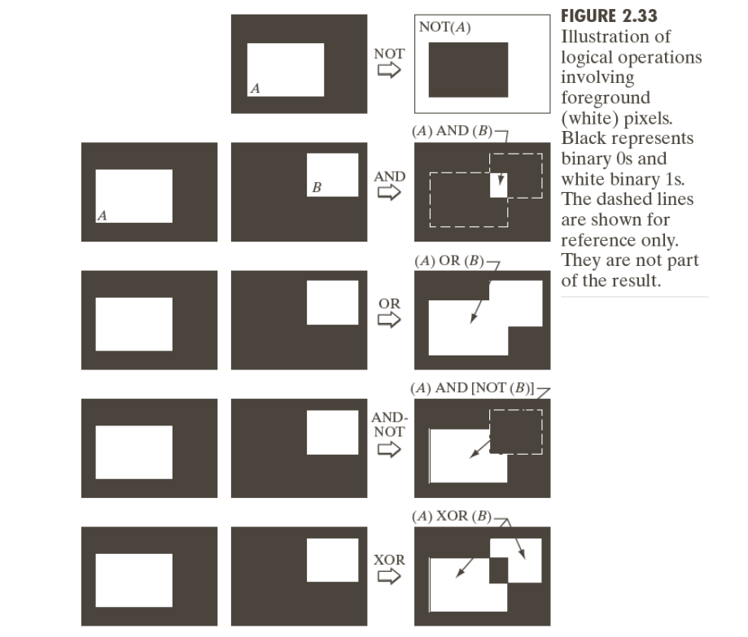

### Translation

Image A translated by movement vector t:

- A<sub>t</sub> = {c | c = a + t for some a ∈ A}

### Structuring Elements

SE's are small sets or sub-images used to probe an image for properties of interest

Similar to filter kernels (moved across an image to inspect/process all pixels)

Can have any size and shape (usually square or rectangular)

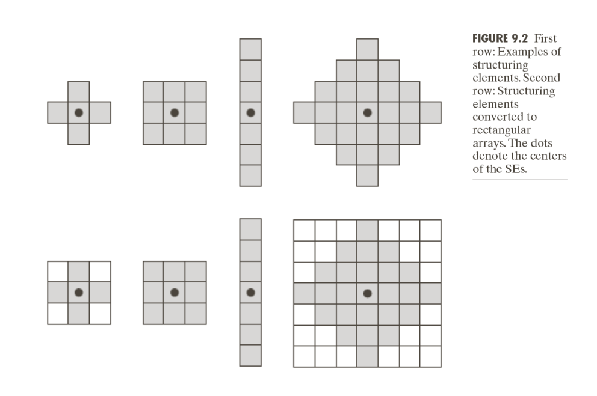

SE defines a neighbourhood (similar to a filter kernel/mask) to specify which neighbouring pixels are considered.

SE visits each element of a set (or image)

Interact with the image through set operations to yield new image values

New image value defined by

- current image value
- set operation
- other current image values at locations covered by SE

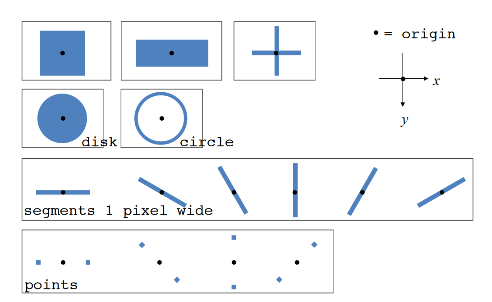

### Fit

- All **on-pixels** (pixel = 1) in the SE cover on-pixels in the image

### Hit

- Any **on-pixels* in the SE covers an on-pixel in the image

All morphological processing operations can be modelled based on hits and fits

### Erosion

The erosion of A (image) by set B (structuring element) is defined as:

- A ⊖ B = {x | (x + b) ∈ A for every b ∈ B}
- A ⊖ B: erosion of image A by structuring element B

The SE B is positioned with its origin at a location in the image and the new pixel value at that location determined as:

    1 (on) if B fits A
    0 otherwise

E.g.:

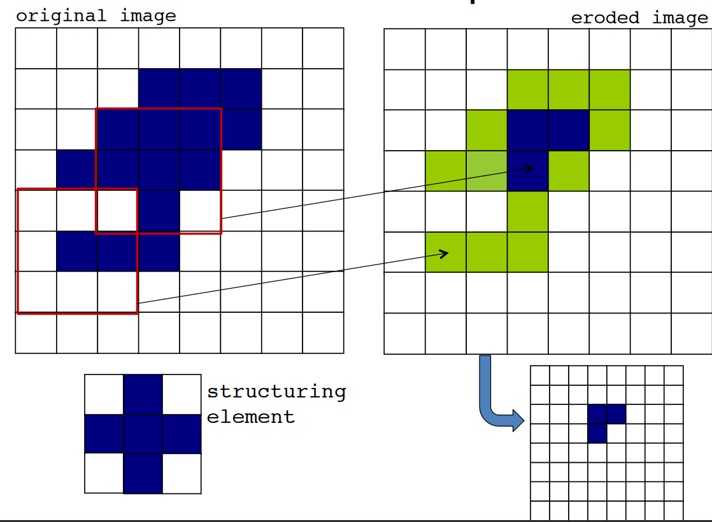

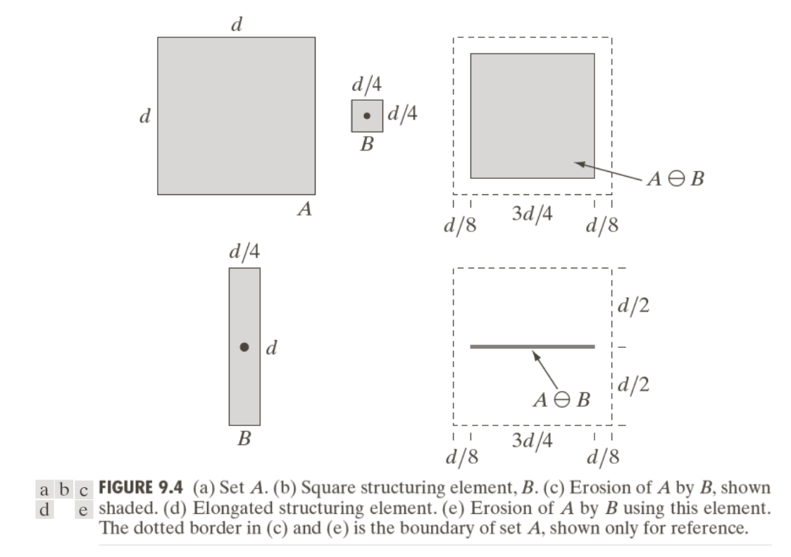

- Erosion can split joint regions/objects and can remove extrusions
- Erosion always shrinks regions/objects

E.g.:

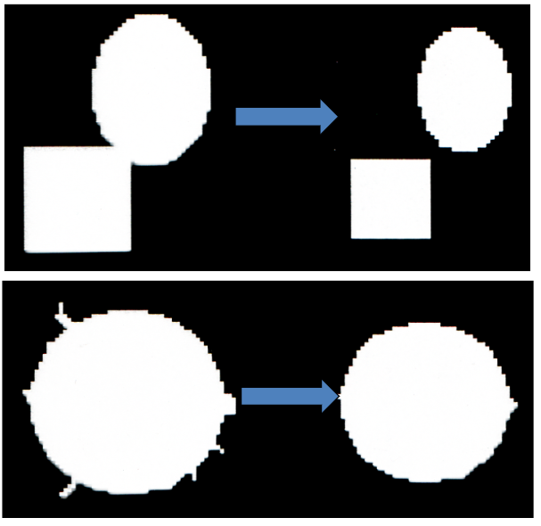

### Dilation

The dilation of A (image) by set B (structuring element) is defined as:

`A ⊕ B = {x | x = a + b for some a ∈ A and b ∈ B}`
`A ⊕ B: dilation of image A by structuring element B`

The SE B is positioned with its origin at a location in the image and the new pixel value at that location determined as:

```
1 (on) if B hits A
0 otherwise
```

E.g.

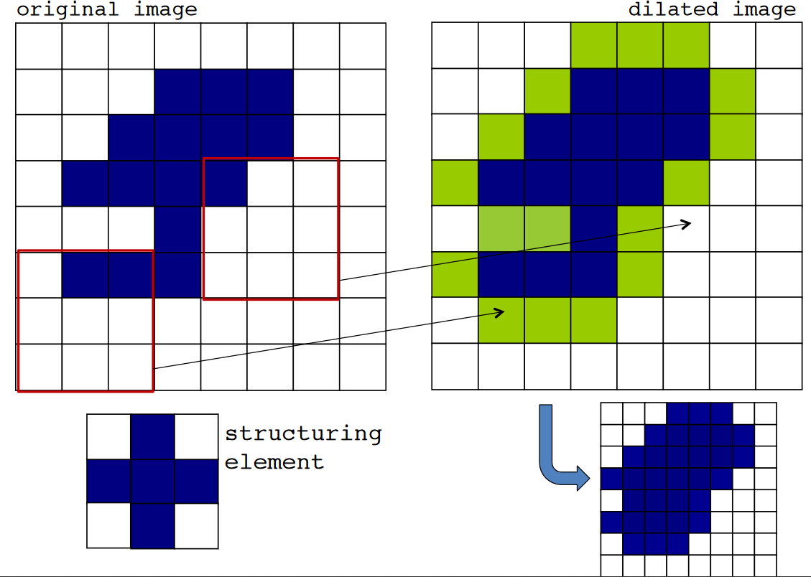

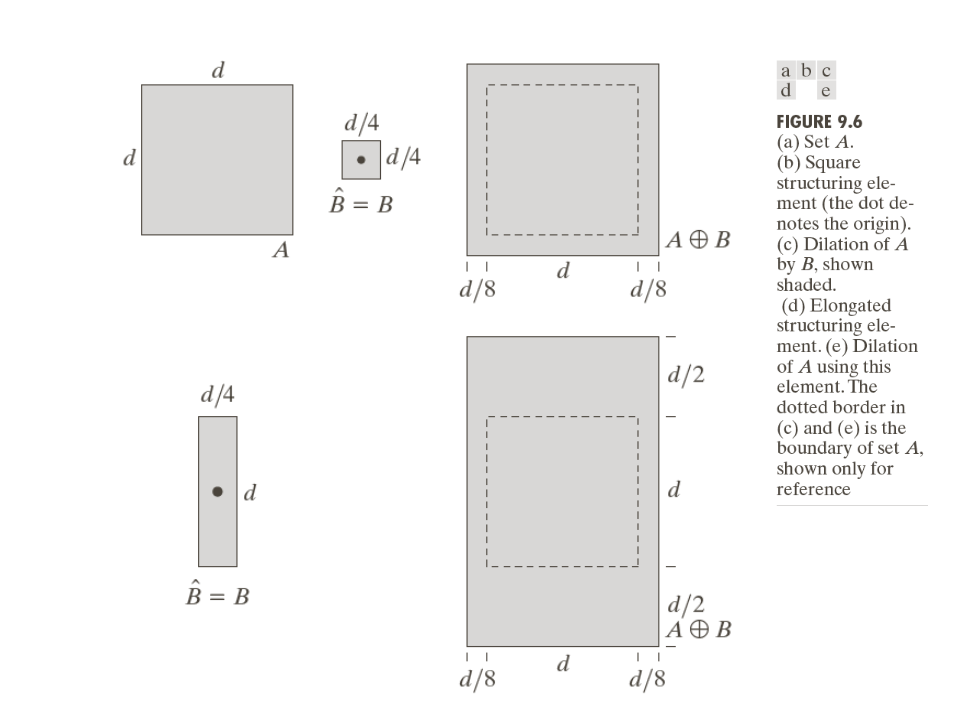

- Dilation can repair gaps/breaks and can fill intrusions
- Dilation always enlarges regions/objects

E.g.

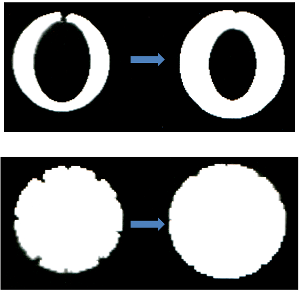

**Note:**

- Dilation is not the inverse of erosion
- Erosion is not the inverse of dilation

### Opening
Morphological opening combines erosion and dilation

Opening = erosion followed by dilation with the same SE

- A ○ B = (A ⊖ B) ⊕ B

Morphological shrinking followed by morphological expansion

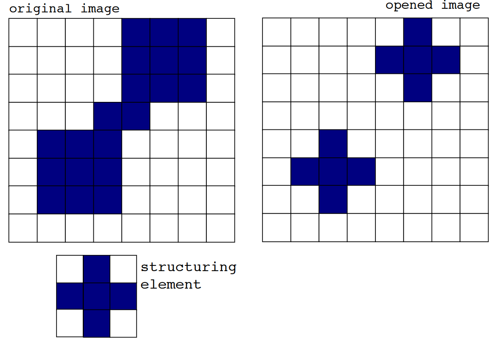

Opening:

- smoothes object boundaries
- eliminates extrusions
- can split objects apart
- removes isolated pixels/pixel groups

### Closing

Morphological closing combines dilation and erosion

Closing = dilation followed by erosion with the same SE

- A ● B = (A ⊕ B) ⊖ B

Morphological expansion followed by morphological shrinking

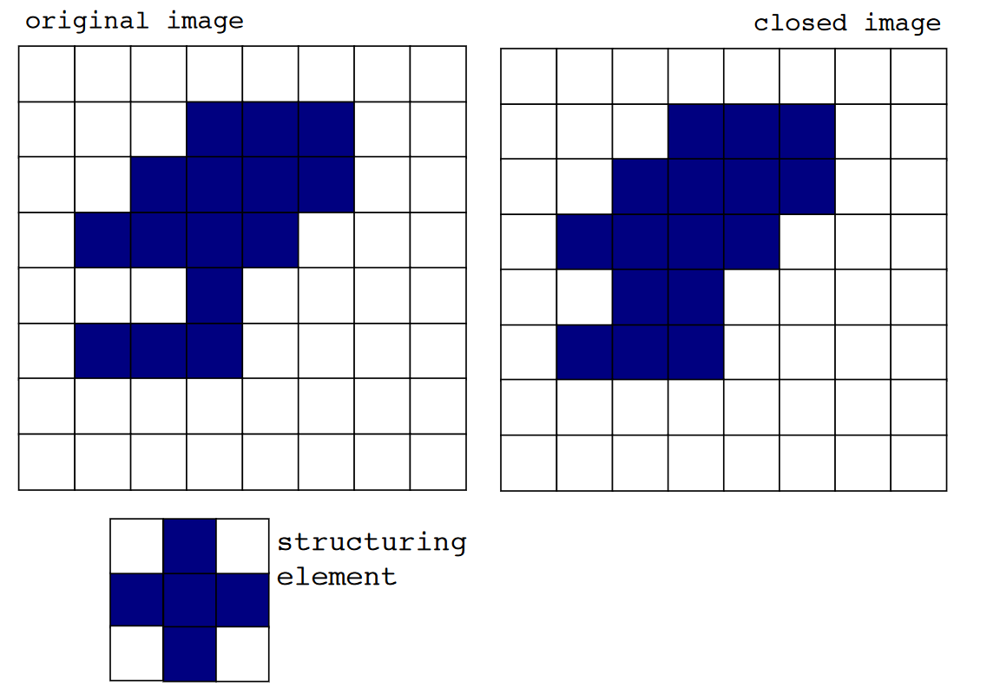

Closing:

- smoothes object boundaries
- eliminates extrusions
- can link closely objects
- removes holes

**Note:**

- Closing is not the inverse of opening
- Opening is not the inverse of closing

### Properties of Opening and Closing

**Properties of Morphological opening:**

- A ○ B is a subset (sub-image) of A
- If C is a subset of D, then C ○ B is a subset of D ○ B
- (A ○ B) ○ B = A ○ B

**Properties of Morphological Closing:**

- A is a subset (sub-image) of A ● B
- If C is a subset of D, then C ● B is a subset of D ● B
- (A ● B) ● B = A ● B

### Morphological Boundry Extraction

Based on erosion, the boundary can be extracted by:

- β (A) = A - (A ⊖ B)

E.g.

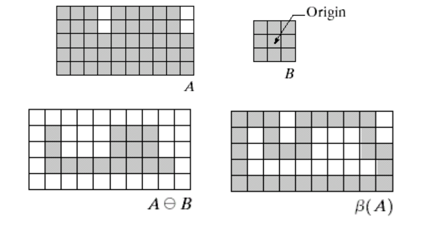

### Morphological Region Filling/Hole Filling

Given a boundry and a pixel inside the boundry, region/hole filling attempts to fill that boundry with object pixels (i.e with 1's)

Repeated dilation, followed by intersection with (complement of) boundry:

X<sub>k</sub> = (X<sub>k-1</sub> ⊕ B) ∩ A<sup>c</sup>     k = 1,2,3...

- A: boundry
- A<sup>c</sup>: comnplement of boundry
- X<sub>0</sub>: starting point inside boundry

Repeat until there is no change

E.g.

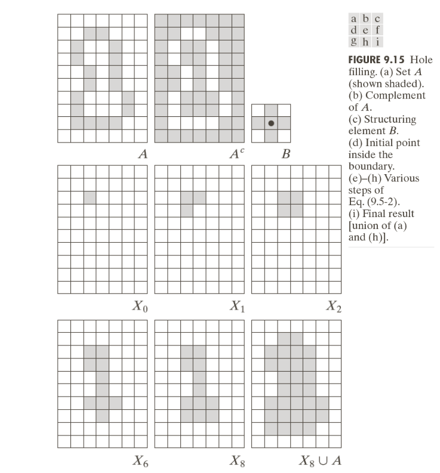

### Morphological Hit-or-Miss Transform

Used to identify particular patterns of foreground or background pixels in binary images

- Very simple object recognition

Hit-or-miss structuring elements:

    - 0's (background) and 1's (foreground)
    - "don't care" elements
    - e.g. SE for corner detection:

        -   1   -
        0   1   1
        0   0   -

If foreground AND background mixels match image region covered by SE:

    - set pixel at origin to 1 (foreground)
    - otherwise set pixel to 0 (background)

Outputs of different hit-or-miss transforms can be combined

### Morphological Corner Detection

Based on hit-and-miss transform

Corner SELs:
**SEL:** Structuring ELements

    -   1   -       -   1   -       -   0   0       0   0   -
    0   1   1       1   1   0       1   1   0       0   1   1
    0   0   -       -   0   0       -   1   -       -   1   -

    - one for each type of corner

OR the outputs

E.g.

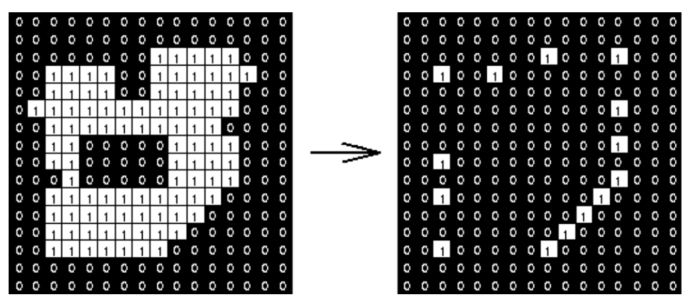

### Morphological Thinning

Based on hit-or-miss transform and thinning SE's

Repeat until no change

- Repeat with each thinning SE
    - Calculate hit-or-miss transform of the current image with SE
    - Subtract the result from the current image to yield new current image

E.g.

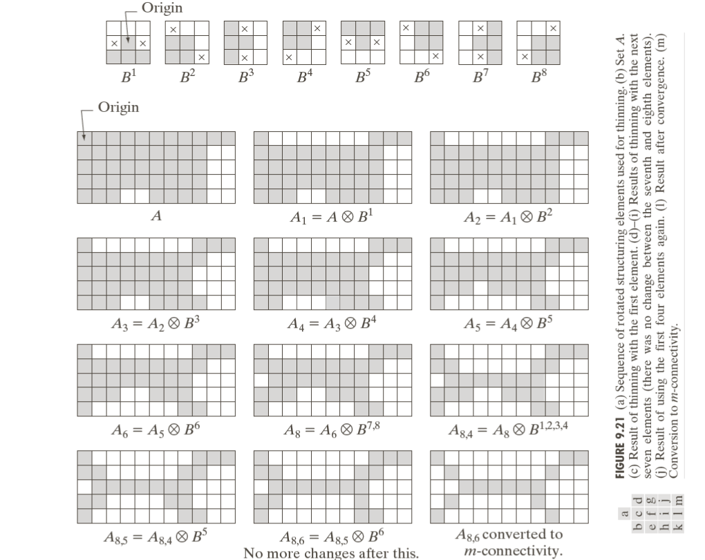

----------------------

## Topic 4 - Content­‐based image retrieval

[PDF](http://learn.lboro.ac.uk/pluginfile.php/480347/mod_resource/content/6/COC202_1718_lect_04.pdf)

### Traditionally

Traditionally images were retrieved using **text annotations**. This is were each image is tagged with a set of *keywords* or *textual description*. Then a standard text search can be used to obtain images.

**+** Text search is easy
**+** Use SQL databases for query interface
**+** Use natural language processing (NLP)

> **NLP - Stemming**
> Reduce words to their word stem.
> "stems", "stemmer", "stemming", "stemmed" are all reduced to "stem".
> This allows for more broad searching as it reduces the possibility of a slightly different wording

**-** Words convey inexact information
**-** Not everything is easily describable e.g. mood, texture
**-** Impractical - lots of images
**-** Descriptions are subjective

### Content-Based

Features are extracted from the images themselves. These features are used to index and search for the images.
Searching for similar images involves search for a similar feature set.
Features include:

- Color
- Texture
- Shape
- etc.

#### Color

Color features are most widely used.

Color histograms work well:
- simple
- good retrieval performance
- not affected by translation or rotation
- robust to occlusion (cover part of the image)
- heart of many search engines (QBIN, Virage, etc...)

**Comparing color histograms**
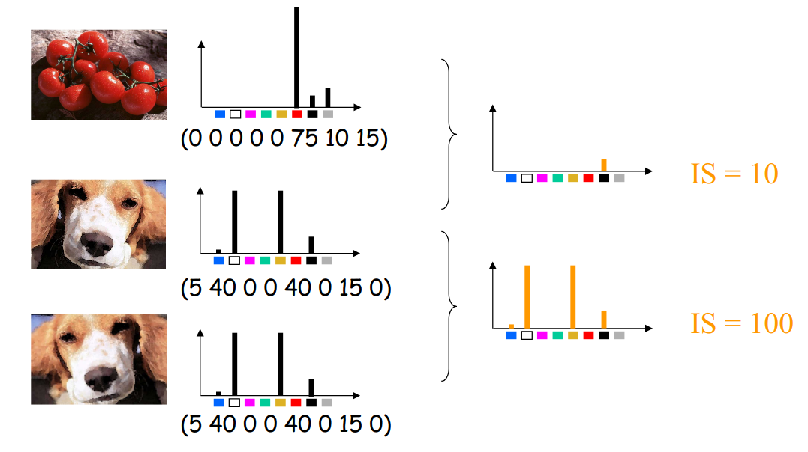
Normalize values to sum to 100% - this normalizes image size.
Compare similarity using the below formula. `is=0` means completely different, `is=100` means identical.

```javascript
is = 0
for(color in histogram) {
  is += min(H1[color], H2[color])
}
```

To define a good color pallette we divide color space uniformly along colour axis.
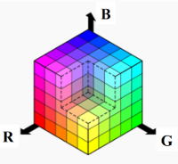

Calculate histogram for all images.
histogram is the index to be stored.

Search is **query by example** (QBE)
1. Calculate histogram for query image
2. Calculate histogram intersection between query and all other histograms
3. Rank images by score
4. Return best results

We can also calculate the distance between histograms
The smaller the distance the more similar
- From similarities: `1 - intersection` (if histograms were normalized to sum to 1)
- 
  - manhattan distance
  - equivalent to histogram intersection
  - can use other distances such as *euclidean*

##### Quadratic Distance Measure
A slight shift in color can result in a very different histogram and thus retrieval failure.
Idea: take similarity of neighboring bins into account

```javascript
d(i1, i2) = (h1 - h2) * A * (h1 - h2)^T
```

- `A` contains inter-bin distances
- without A it becomes (squared) euclidean distance

*This is all that is said on this topic*

##### Color Moments
- Moments as a compact color descriptors
- n-th central moment
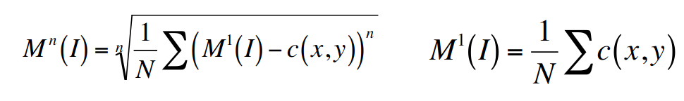
- L1 norm between moment vectors

- Moments can be used as lower bound for histograms.

//TODO: some research on color moments. Lecture Capture: **1st march 1:35:00**

**Problem:**
```javascript
R = red  W = white

RRRRRR     RWRWRW
RRRRRR     WRWRWR
WWWWWW     RWRWRW
WWWWWW     WRWRWR
```
The above two images have an intersection of 100% despite being very different.

##### Color coherence vectors
- Aim to take spatial infomation into account
- 2 histograms are created, ISs added.
  - one for pixels in uniform areas
  - one for scattered/lonely pixels
  - look at a pixels neighbourhood to determine if it is scattered or not.

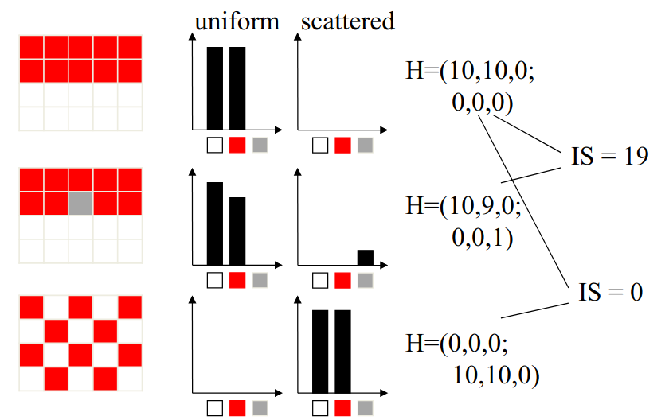

##### Color correlograms
Record probabilities of co-occurrances of colors at certain distances

If i have a pixel of a certain color in the image, what is the probability of having a similar  color a certain distance away

Auto-correlogram: probability of the **same color** a set distance away


#### Texture
- Determines appearance but is hard to define
- Made of neighbourhoods of pixels rather than individual ones
- Attributes:
  - Directionally
  - Periodicity
  - Randomness

##### Local binary patterns
Discribes direct pixel neighbourhoods.

1. Take each pixel, and compare it to its 8-neighbourhood
2. Threshold the neighbouring pixels with the main pixel in the middle
3. retrieve sequence of 8 bits (256 possible values).
4. use this sequence as index to histogram (256 buckets)
5. Compare histograms
```javascript
  6 5 2                     1 0 0
  7 6 1   ===threshold===>  1   0
  8 8 7                     1 1 1
                           <- ^ Start

  sequence = 11110001 = 241
```

#### Shape
Divide image into 4x4 blocks.
Check block for predefined edge patterns (horizontal, vertical, &plusmn;45<sup>&deg;</sup>

##### Patterns:
```brainfuck
++++ ++++ ++++
---- ++++ ++++
---- ---- ++++
---- ---- ----

---+ --++ -+++
---+ --++ -+++
---+ --++ -+++
---+ --++ -+++

--++ -+++ ++++ ++++
---+ --++ -+++ ++++
---- ---+ --++ -+++
---- ---- ---+ --++

---- ---- ---+ --++
---- ---+ --++ -+++
---+ --++ -+++ ++++
--++ -+++ ++++ ++++
```
Build a 14x1 histogram.
Compare histogram intersections.

### Image moments
(not color moments)


- 0-order moment -> mass
- 1-order moment -> center of gravity
- 2-order moment -> orientation
<br>
- Moments can be used to reconstruct the original image
- Can be used as low dimensional image features
- Describe asymmetries, shape features, etc

#### Invariant Moments
- moments change with translation, rotation, scale and contrast
- useful image features should be independent of these factors

##### Central Moments
- Invariant to **translation**
> It moves the subject to the center


##### Normalized central moments
- Invariant to **translation** and **scale**


##### (Hu's) moments invariants
- Algebraic combination of central moment
- Invariant to translation, scale and rotation

> Its a giant list of formula
> I cant imagine we will need to know it

##### (Maitra's) moment invariants
- Combination of Hu moments
- Invariant to contrast, scale, rotation and translation

### Combining multiple features
Querying for images based off of a single feature is often insufficient.
Color histograms, LBP histograms and edge histograms can be combined by summing each intersection score.

Applying weights we can add emphasis to certain features.

```javascript
score = (0.5  * color score) +
        (0.25 * texture score) +
        (0.25 * shape score)
```

Since features can be of different types they can have different magnitudes. Simple distances like L1, L2 would get biased by bigger values.
We need to normalize the features to make them equal (and thus comparable).

- subtract mean => similar magnitudes
- divide by S.D => similar distribution

or use appropriate distance measure such as Mahalanobis distance.

> *Taken from somewhere on the internet:*
> The Mahalanobis distance has the following properties:
> - It accounts for the fact that the variances in each direction are different.
> - It accounts for the covariance between variables.
> - It reduces to the familiar Euclidean distance for uncorrelated variables with unit variance.

### Video Retrieval
Indexing every frame of a video is not feasible.
Taking every n-th frame is also ineffective.

Videos need to be segmented based on content i.e based on shots.
- Hard cut = instantaneous transition
- Soft cut = animated transition such as fade, disolve, wipe

#### Shot cut detection
Consecutive frames tend to be very similar and thus contains a lot of redundancy.
Cuts mark a big difference.
Shot cut detection is nothing more then similarity detection between frames.

##### Color histograms
1. calculate color histogram for every frame
2. perform histogram intersection between neighbouring frames.
3. an intersection below a set threshold indicates a possible cut.

#### Key frame selection

Once a video is split into shots - each shot having one or more representative frames (key frames)

Methods:

- **first frame**
- **middle frame**
- **fixed n** - select n-th frame
- **centroid frame** - select frame whose distance to all other frames in shot is minimized.

These key frames can be used during retrieval.

### Semantic Gap

Computers cant identify whats in the image. They can identify low-level features.
Our semantic understanding of the image cannot be accurately modelled using low-level features.
This is the semantic gap.

approaches to bridge gap:

- Relevance feedback.
- Image classification and annotation
- image database navigation/browsing


#### Relevance Feedback

Retrieval using features and similarity measures not perfect. Include users in the loop.

1. User is presented with initial retrieval.
2. Results then interactively refined.
3. User specifies whether images are relevant until results are acceptable.

A weighted intersection is used.
During feedback, weights associated with positive features are increased and weights associated with incorrectly retrieved images are decreased.

### Image Classification

- Segment image to extract regions
- regions associated with words
- statistical modelling is needed to derive probability models for individual regions

### R-trees

There is a lot of data to store for CBIR, an exhaustive search will take too long.
Features are usually high-dimensional

R-Trees offer a data structure for efficient retrieval of high-dimensional data.
Originally used to index spatial data.
Data is stored in a tree such that during querying only part of the complete structure needs to be examined.

The space is divided in N-dimensional cubes (squares for 2d)

Data is stored on the Leaves
The nodes hold the dimensions of the bounding box and pointers to child nodes
If the number of children rise above a set limit then the bounding box is split

R-Trres have 2 parameters:
- M: **max** number of children
- m: **min** number of children

Adding a leaf node
1. find the region it fits into
2. if there are fewer then M children then add it to the region (adjust bounds if needed)
3. if there are more then M then split the region in twine.
	- Each new sub region must contain at least `m` children.
	- Check if the split affects and nodes further up the tree and create/split regions as needed

#### Retrieval
We want to retrieve all samples within a given region.
The search is based on the overlap of bounding boxes and the query region.

1. At the root of the tree, if the bounding box intercepts the query then descend into the node.
2. If the children are intermediate nodes, repeat step *1* for the node.
1. If the children are leaf nodes, then check each one to see which are in the query region.

----------------------


## Topic 5 - Image database visualization and browsing

[PDF](http://learn.lboro.ac.uk/pluginfile.php/481561/mod_resource/content/7/COC202_1718_lect_05.pdf)

### Image databsae browsing

- Query by example (QBE)
	- Query by image content (QBIC)
	- Feature vector of query image produced and compared to feature vectors in DB.
- query by sketch (QBS)
	- similar to QBE except features extracted from a sketch provided by the user.
- query by keyword
	- requires annotation, either manual or automatic

Problem by X as problems:
- needs a query
	- image (why search if you have one?)
	- sketch (try drawing "wind")
	- keyword (not precise, time consuming to label)
- What if your idea of what your searching for isnt refined
- CBIR systems are black boxes
- Results not always superb
- Most images arent returned to user
	- only the best ones?
	- content of whole DB remains unknown

Solution: Browsable image collections
- visual overview of the complete image database
- users can interactively browse
- no query needed
- helps bridge semantic gap
- browsing is fairly intuitive
	-	users dont need to learn how to form a query

> Traditionally image browsers display contents in a linear fashion
> sorted by date :O
> This is hard to browse

There are 2 mean tasks:
- Visualisation
	- image arrangement
	- where to place images on screen
	- definition of visualisation space
- Navigation
	- the actual browsing
	- interactivity
	- partly constrained by visualisation method

### Mapping based visualisation
- High-dimensional CBIR feature vectors
- visualise in low-dimensional space (2 or 3)
- need to get from high-dimensional space to low dimensional space so the relations are preserved
	- similar images should be close to each other in visualisation

#### PCA (Principal component analysis)
- Karhunen-Loeve transform (KLT), Hotelling transform, ...
- Orthogonal transformation to convert data into a new space
	- Decorrelate data
	- Capture maximum variance in fewest components
- Useful for:
	- "Better" representation of data.
	- Discovering patterns in (high-dimensional) data.
	- Dimensionality reduction
	- Feature reduction, compression
	- visualisation

##### <review-of-basic-stuff&gt;
> Slides 16-19 for formulae

- Mean
- Standard Deviation
	-	describes spread
- Variance
	- square of standard deviation
- **Covariance**
	- operates on two vars `cov(X, Y)`
	- indication of how one variable is related to another
	- variance is a special case of covariance `var(X) = cov(X, X)`
- Covariance matrix:
	- 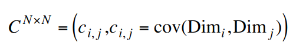
	```bash
	    | var(X)    cov(X, Y) cov(X, Z) |
	C = | cov(Y, X) var(Y)    cov(Y, Z) |
	    | cov(Z, X) cov(Z, Y) var(Z)    |
	```
- Eigenvectors
	- Eigenvector of a (square) matrix: vector that when multiplied by the matrix gives a scaling of the vector
	- can normalize (to unit length)
	- 
	- 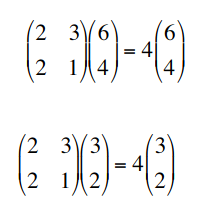
	- for an NxN matix we can compute N eigenvectors
	- eigenvectors are othogonal
		- orthonormal for unit length eigenvectors
	- can be calculated by an iterative process
		-	in matlab it is done with the `eig()` method
> **orthonormal** *adjective* - both orthogonal and normalized.

**<review-of-basic-stuff /&gt;**

##### Procedure
1. calculate covariance matrix of data
2. compute eigenvectors of the covariance matrix
3. sort eigenvectors by corresponding eigenvalues
	-	sorts the vectors by importance
	- captured variance given by eigenvalues
	- **sorted eigenvectors = principal components (PCs)**
4. Project data onto space spanned by PCs
	- matrix containing eigenvectors can be used as projection matrix
	- multiplication with data matrix

##### Usage
- Data projected into new space spanned by PCs.
	- PCs are weighted sums of original data axes.
- Projection itself is lossless
	- Data has same dumensionality
	- can be fully recovered through inverse transform
- we can also project into a lower-dimensional space
	-	space spanned by k PCs with largest eigenvalues
	- captures most important information
	- other data can be discared without losing much infomation
	- reconstructed data close to original.

> Slide 22 shows a flow chart of doing/using PCA

##### For Feature Reduction
- High-dimensional features for classification, retieval, etc
<br />
- run PCA on data.
- select k PCs to define new feature space.
- project data into new space.
	- co-ordinates/weights in new space = new (reduced) features
- Use new features for classification, retieval, etc.
<br />
- Often gives comparable or possibly even better results than original features.

##### For (face) recognition
- Normalised face images treated as data vectors
- run PCA on that data
	-	pick k PCs = eigenfaces
- Face represented by co-ordinates/weights in new space.
- Face recognition e.g by finding closest face in new space (Euclidean distance)

##### For image database visualisation
- Images represented by high-dimensional feature vectors
- perform PCA on image feature data.
- take first 2 (or 3) principal components to define visualisation space.
- Project feature vectors into low-dimensional space
- plot image thumbnails at calculated co-ordinates
- similar images will get projected to similar locations

----------------------

#### MDS (Multi-dimensional scaling)
- Projection to lower dimensional space.
- attempts to best preserve the original distances
- based on pair-wise distances between samples
	- square (triangular) matrix
	- can use any kind of distances
	- no need for actual data vectors
- intial configuration
	- e.g through PCA
<br />
- Iterativly change configuration to better fit the data
	- minimise stress
- MDS will allow for more accurate representation
	- Inherently similarity/distance based
	- Allows for other distances than L<sub>2</sub>
- But also is slower

##### For image database visualisation
- Obtain distances between images (from feature vectors or otherwise)
- Decide on dimensionality of projections (typically 2)
- generate initial configuration
- perform MDS
- plot image thumbnails at calculated co-ordinates
<br />
Similar images will get projected to similar locations

----------------------

### Clustering-based visualisation
- similar images are grouped together
- groups can be summarised by representative images.
<br />
- Content-based
	- using CBIR features of the images
- Metadata-based
	- Uses keywords
	- filenames
	- etc
- Time-based
	- Using image creation date

#### K-Means
- equal grouping of similar samples into groups (clusters)
- most popular algo is k-means

1. Initialize k cluster centers (randomly)
2. map each sample to its closest cluster center
3. recalculate each cluster center as the center of mass of all its samples
4. go to step 2 until convergence (clusters don't change)

##### For image segmentation
- divide an image up into different regions corresponding to objects.
	-	its hard
	- many techniques
- K-means clustering can be used
	- select k (not easy)
	- samples = pixels
	- data for each sample = intensity (greyscale) or RGB (color)
	- run k-means using that data
	- "Divide" image according to clusters


### Heiarchical clustering for image browsing
- Hierarchical clustering
	- iterative merging of two most similar clusters to form new cluster
		- until only 1 cluster remains
	- retain old clusters
- Through clusting, a tree structure is obtained
	- Used for navigation
	- representative images for cluster

----------------------

#### Dealing with overlap
> Slide 27-28
Positions generated for image visualisation will often lead to images overlapping one another. Images can be partly or totally occluded. The solution is to move the images, possibly arrange into a grid.

- Fill empty cells on grid by moving cells across from neighbouring cells.
- Place - bump - double bump
	-	place: into empty neighbouring cell
	- bump: neighboring image into 2nd ring them bump

----------------------

### Graph-based visualisation

Arrange images into a graph structure
- Nodes = images
- Edges based on shared annotation / image similarity

<br/>

- Visualisation - mass-spring models
	- edges modelled as springs
	- rest length based on edge weight/strength
	- find stable layout (set of differential equations)
----------------------

### Browsing

- Visualisation on its own is useful but not too much
- Navigation through visualised image database
- Interactivity and intuitive operations crucial

#### Horizontal browsing
- Navigation within a single screen of visualised images
- This type of browsing is often useful when an image database has been visualised through a mapping or graph-based scheme, or a visualisation of a single cluster of images.

##### Panning
If the entire visualised image collection cannot be displated simultaneously on a screen, a panning function is required in order to move around the visualisation.

##### Zooming
If many images are on a single 2D plane, will be too small to distinguish.

Useful to have a facility to zoom into an area of interest.

##### Magnification
Although similar to zooming, magnification usally occurs when a cursor is placed over an image
> true madness

Fisheye lens distorts images around cursor.

#### Vertical browsing
In visualisation approaches based on a hierarchical structure, images can be navigated using vertical browsing.

Clusters of images are typically visualised through use of representative images.

These images are cruscial for vertical browsing as these are typically the reason for which a vertical browsing step into the next level of the hierarchy is initiated.

As a result, images belonging to the cluster but not shown previously, are presented to the user


#### Graph-based browsing
Operations such as panning and zooming can in general be applied to graph-based visualisations.

In addition navidation can be performed following the edges that connect images.

#### Time-based browsing

Time stamp infomationattached to images can be used arrange and visualise image collections.
Clearly if a collection is visualised based on temporal concepts, browsing should also be possible based on time.
Often clustering-based, using representative images for clusters that correspond to certain time periods.

----------------------

### A Browsing Application
**Hue sphere image browser**

> Slides 54-65


Attribute extraction:
- extract median colour
- hue and lightness (between 0 and 360 degs. It uses cos)

These values are used as x, and y values respectivly.
All images from DB are mapped onto a globe.
Visualisation space not optimally used.

**Heirachical hue sphere** arranges images into a grid on a sphere. This means the space is better utilised.

### Evaluation of image browsing systems
- How do we know whether an image browsing system is useful and effective not just awesome looking?
- How do we know that it will facilitate work?!
- Given two browsers how do you determine which is better

#### Target Search
- Give user an allocated time to search for a specific image.
	- also applicabale to traditional CBIR approaches
	- can compare browsing vs retrieval
- Simplest to conduct
	-	most common test
- Can be aceraged for a set of queries
- Lower time suggests better usability
- Number of time-outs and number of incorrect results can also be measured
- distinctiveness of an image (how similar it is to all other images) can affect retieval performce.

#### Category search
- give user an example image or keyword and ask user to locate N semantically relevant images from the system.
- similar to target search but does not have to be exhaustive
	- More than N matches in DB
- Relatively simple to conduct
- Time taken to select images, time-outs and the error rate can be measured (errors calculated by consulting pre-defined ground-truth)
- Can also investigate how user arrived at the N images.
	- images vs time

#### Journalistic task
- commmon use of image retrieval systems for journalistic purposes are "searches to illustrate a document"
- User given an article of text and asked to illustrate
- In essence, a variant of a category search.
- Time taken and relevance of retievd images can be measured

#### Annotation task
- Task is for user to annotate a dataset.
- image browsing systems useful to aid annotation
- rivh set of measurements can be extracted from the task including number of interactions, error rate and time taken.
- Can be measure in principle for any system
	- if annotation function has been added
- In essence, very similar to category search.

#### User opinion
- Users are asked to complete a questionnaire in order to gauge their opinion on the system and/or aspects of the user interface
- Should be implemented in conjunction with another more objective task
- Questionnaires can be analysed statistically
- Can be useful in gaining insights into usefulness of different aspects of the system, which may lead to improved appraches.


### Summary
- Image browsers provide an alternative to retrieval-based approaches
- visualisation/browsing by visual similarity
- Mapping-based - Clustering-based - graph-based.
- PCA (not only) for visualisation
- Clustering (not only) for visualisation
- Browsing: horizontal - vertical
- A sample image browsing application: hue sphere image browser.


----------------------


## Topic 6 - Colour consistancy and colour invariance

### Adding Colour
- Light can be split into colours
- Colours can be added together

Our retinas percieve colour using cones. We have red, green and blue cones.

### Colour based image retrieval(Uses QBE)
1. A colour histogram can be created for each image in a database, where the colour histogram is equal to the index that each image is saved under.
2. A query image is input and a colour histogram is created for that image. The histogram intersection between the query image and all images in the database are compared.
3. Rank images bu intersection score
4. Show top results to user

#### Advantages of colour indexing
- Simple technique
- Good retrieval performance
- Not affected by rotations or translations
- Robust to occlusion

### Colour image formation


>**Chromaticity** - An objective specification of the quality of a color regardless of its luminance.

#### Chromaticity space
- Ignores intensity information
- Invariant to imaging geometry
- Invariant to shading

#### Illuminants
Image colour changes depending on illuminant
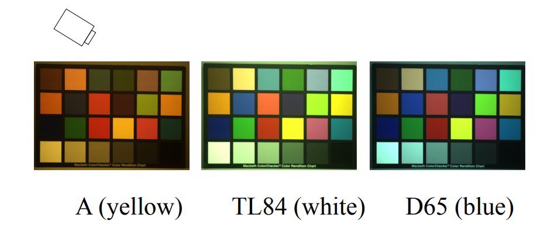

Illumination change can be modelled with a relatively simple model.
Two images are a linear transformation away if:
I<sub>1</sub> = I<sub>2</sub>*T
or if using the diagonanl model:
I<sub>1</sub> = I<sub>2</sub>*D
where:
I<sub>1</sub> = 1D matrix (R<sub>1</sub>, G<sub>2</sub>, B<sub>3</sub>)
& I2 = 1D matrix (aR<sub>1</sub>, bG<sub>2</sub>, gB<sub>3</sub>)

#### Computational colour constancy
Is the estimation of the illuminant colour and can be used to colour correct images.
There are two main approaches:
- Statistical colour constancy algorithms:
	+ e.g. Greyworld, maxRGB
	+ Correlate the statistics of colours in an image with statistical knowledge about lights and surfaces.
	+ works well if there are many surfaces in the scene
	+ only works for a limited colour diversity
- Physics-based colour constancy algorithms:
	+ e.g. Dichromatic colour constancy
	+ Based on understanding on how physical processes manifest themselves in images. e.g. shadows, interreflections
	+ can give a solution even if there are very few surfaces in a scene.
	+ Difficult to make work outside the lab

##### Greyworld colour constancy
Assumes the mean of each image is the same(grey).
alpha = mean(R)
beta = mean(G)
gamma = mean(B)


##### MaxRGB colour constancy
Also known as white patch retinex.
Assumes that the brightest patch in the scene is a white patch.


##### Dichromatic reflection model
*Note:* I don't really know what this means
- Valid for inhomogeneous dielects: -paints plastics, papers, textiles etc
- States that the reflected light from an object has two parts:
	+ body reflection
	+ interface reflection
- both parts are comprised of:
	+ spectral power distribution of the respective reflectance
	+ geometry depending scale factor

##### Matte, Lambertian or Body reflectance


##### Highlight, specular or interface reflectance
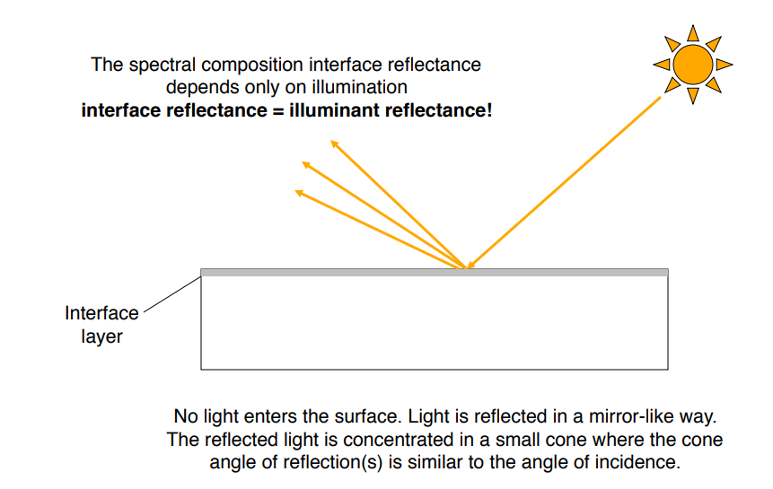

##### Dichromatic reflectance


----------------------

## Topic 7 - Texture
[PDF](http://learn.lboro.ac.uk/pluginfile.php/489474/mod_resource/content/9/COC202_1718_lect_07.pdf)

Textures are relatively easy to understand and recognise visually, but quite hard to define.

Texture relates to an area/neighborhood not individual pixels. (even though we may calculate texture measures per pixel)

Typically whether somthing is refered to a texture is to do with the distance being viewed from (think texture vs shape)

Texture can be defined as variation in intensity of a particular surface or region of an image.
This characteristic variation should allow us to describe and recognise it, as well as outline its boundry

### Applications
- **Detection** Diserning objects from background.
- **Segmentation** separating image regions
- **Boundry detection** e.g skin lesion segmentation
- **Retrieval**
- **classification** e.g human cell identification, nailfold capillaroscopy
- **sysnthesis** computer generated new images

### Texture Measures

Texture = a visual pattern of **repeated elements** that have some variation in **appearance** and **relative position**.

Repeated elements are known as: *texture primitives* or *texels*
Texels can vary:
- slowly or rapidly
- with a high or low degree of directionality
- with a greater or lesser degree of regularity

- regularity is generally taken as key to determine if texture is regular/periodic (such as zebra) or random/stochastic (like clouds)

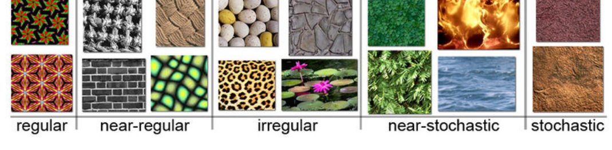

#### Statistical Descriptors
Statistical approaches yield categorization of textures as smooth, course, grainy, etc.

Each texture is described by a feature vector or poperties/features.

One of the similest appraches to describe texture is to use statistical moments of the intensity histogram of an image or region.

Let <code>P(Z<sub>i</sub>), i=0,1,...,L-1</code>, be the histogram of an image z with L distinct intensity levels.

**Mean value (average intensity)**
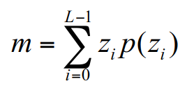

**Variance σ<sup>2</sup> / second order moment μ<sub>2</sub>(z)**
Measure of contrast
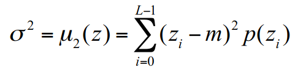

- Smoothness
	- 0 for areas of constant intensity
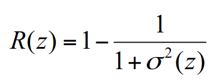

**Third order moment**
Measure of the skewness of histogram
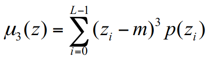

**Energy/uniformity**
High for narrow histograms (1 for uniform image)
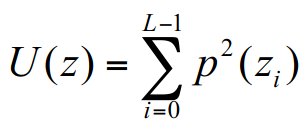

**Entropy**
Measure of randomness
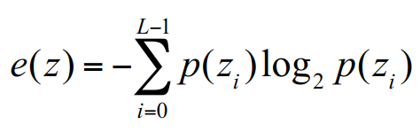

> Example of these measures on slide 20

Segmentation of texels using statiscal descriptors is difficult in real images. Since descriptors are image/region based.
Histograms carry no information regarding the relative positions of pixels with respect to each other.
While this apprach is less intuitive and may not perform too well, the advantage is simplicty and hence computational efficiency.

#### Co-occurrence matrix
Considers the relative positions of pixels in an image (as well as the distribution of intensities)

Based on an operator that defines the position of two pixels relative to each other.
- e.g left/bottom/+45deg/-45deg neighour at a certain distance (e.g 1)

An element of the co-occurances matrix gives the frequency that pixel pairs with two such intensities occur in the image according to the image defined operator.
	- The two intensities define the row/column of the matrix element

E.g. operatator = "one pixel immediately to the right"
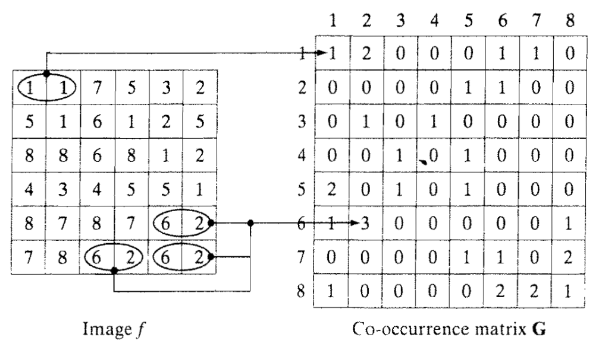
> There is an imcomplete grid on slide 24 to try. No answers provided though.

#### Co-occurance features
Rather than using the matric directly, we calculate various descriptors from the matrix.

Simple descriptors (form basis of other ones):
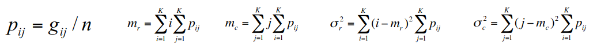

**Max probability**
measures the strongest respnse of the matrix
<code>max(P<sub>ij</sub>)</code>

**Correlation**
Measure of how correlated pixels are with their neighbours
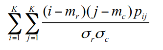

**Energy**
Measures uniformity of the matrix.
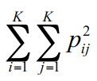

**Contrast**
Measures image contrast...
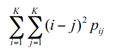

**Homogeneity**
Measures the spatial closeness of the distribution of the lemenets to the diagonal.
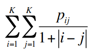

**Entropy**
Measures the randomness of the matrix elements.
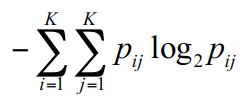


#### LBP (Local binary patterns)
> This was covered earlier. So may want to do some unification.

Encodes the relationship of a pixel to its local neighborhood in the form of a **binary pattern**.

Basic LBP operates on a per-pixel basis and descripes the 8-neighborhood pattern in binary.

```javascript
  6 5 2                     1 0 0
  7 6 1   ===threshold===>  1   0
  8 8 7                     1 1 1
                           <- ^ Start

  sequence = 11110001 = 241
```

##### Circular LBP
Instead of the 8-neighborhood, a circular neighborhood at a set pixel distances can be employed.

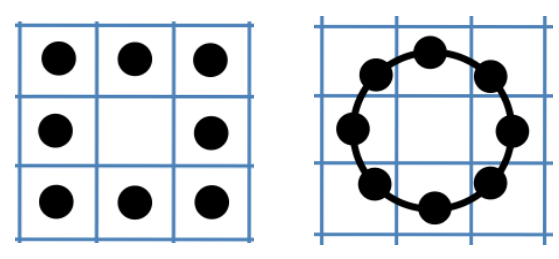

This results in some points not falling directly on a pixel. Here, we **interpolate**.

##### Rotation Invariant LBP
If the texture is rotated then the binary patterns produced will change.

Rotation invariance can be obtained by grouping all possible rotations together.
This can be done by considering the unique minimal value of binary patterns.
- Perform all possible rotations (through bitshifts)
- minumun of these gives the selected value

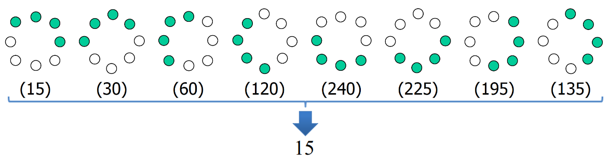

There are 36 patterns for 8-neighborhoods.
> Examples of this on 33 and 34

##### Uniform LBP
Certain binary patterns are fundamental properties of texture
- Sometimes frequency > 90%
- these are **uniform** patterns and are defined by a uniformity measure.
- Uniformity measure can be defined by the number of spatial transitions (changes from 0 to 1 or 1 to 0) in the LBP code. (we typically consider maximum of 2 changes).

In uniform LBP, only uniform patterns are recorded in sparate bins; other codes summarised in single bin.

> example of this on slide 37

This can aslo be combined with rotation invariant LBPs to form: Rotation invariant uniform LBP!!!!
> Slide 36

##### Multi-scale LBP
Texture occurs at different scales.
LBP descriptors can be calculated at different scales by **varying the radius** of the neighborhood.

Multi-scale LMP is thus composed by applying LMP with diferent radii to obtain a texture representation at multiple scales
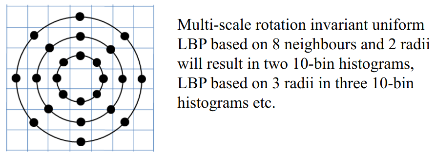

##### Multi-dimensional LBP
In conventional multi-scale LBP, the histograms corresponding to different radii are simply concarenated to generate a singel dimensional feature vector.
This results in a loss of infomation between different scales and added ambiguity.

In an MD-LBP a multi-dimensional histogram is built.

> An example is show on slide 40.

**Potential Problem**: dimensionality of resulting histogram (10x10x10 for rotation invariant uniform LBP at 3 scales)


### Summary
- Textures are easy to understand but hard to define
- There is a variety of texture descriptors used in computer vision
	-	statistical texture features
	- co-occurrence matrix
	- local binary patterns
		- Basic, roation, invariant, uniform, multi-scale, multi-dimensional


----------------------

## Topic 8 - Image compression
[PDF](http://learn.lboro.ac.uk/pluginfile.php/488397/mod_resource/content/8/COC202_1718_lect_08.pdf)

*Reduce the amount of bits to store an image*

> Lossy vs Lossless

### Runlength coding
For each element, specify the number of times the value is repeated

```javascript
Before: 212 211 211 215 214 214 214 214
After:  1,212 2,211 1,215 4,214
```

Useful for sparse data with runs of identical values. E.g images with uniform areas.

### Differential coding
We store the difference to the previous values.

```javascript
Before: 212 211 211 215 214 214 214 214
After:  +212 -1 +0 +4 -1 +0 +0 +0
```

This doesn't actually compress the image.
Since values can be both positive and negative it actually double the number of bits needed as now we need the range off -255 to 255.

However, images typically change slowly and so most of the differences will be small.
We can apply further compression.

### Entropy coding - Huffman coding :D
Huffman coding is the most popular form of entropy coding.

Not all symbols occur with the same probability.
- Assign binary codes to symbols.
- Shorter codes are assign to more common symbols.
	- and thus take less bits to store
- longer codes are assigned to less frequent symbols

Huffman coding results in a huffman table that maps bitstrings to symbols.

Due to the need to store the conversion table, Huffman coding does not work on small data sets.

JPEG uses a standard Huffman table and therefore does not need to be stored, transferred or calculated.
```javascript
Before: 212 211 211 215 214 214 214 214

Before in binary: 11010100 11010011 11010011 11010111
                  11010110 11010110 11010110 11010110

After: 	11010101110000
        214 -> 0
        211 -> 10
        212 -> 110
        215 -> 111

	64 bits to 14 bits!                   (+ the table ¯\_(ツ)_/¯)
```
decoding is the same as encoding but reversed... Figure it out...

#### Creating the table

1. Sort the symbols by frequency
	- 214: 4
	- 211: 2
	- 212: 1
	- 215: 1

2. Take the least two common and combine them into a tree
```javascript
   /\
  /  \
212   215
```

Then sum there frequencies and add this new element into the list in the correct position (according to the summed frequencies).

3. Repeat step 2 until all symbols are merged.

```javascript
     /\
    /  \
  214  /\
      /  \
    211  /\
        /  \
      212  215
```
4. Decending the tree leftwards is a 0 and rightwards is a 1.

> Huffman coding is the **most** efficient way to store data losslessly.
> Proven by the Huffman himself.

### PNG - predictive coding
Extends the previously mentioned differential coding.
PNG looks at previous neighboring pixels and predicts the current pixel (left and up, scan left-to-right, top-to-bottom).

- Simple differential coding, the prediction is the immediate left neighbor.
- More neighbors typically leads to better prediction

The differences between the predictions and the actual values are then coded.

```javascript
-----------
| | | | | |
| |C|B|D| |
| |A|x| | |
| | | | | |
-----------
```
For the pixel X we store the type and the difference to the predicted value

| Type | Name    | Predicted value
|------|---------|-
| 0  	 | None    | Zero (the raw byre passes unaltered)
| 1 	 | Sub     | Byte A (to the left)
| 2 	 | Up      | Byte B (above)
| 3    | Average | Mean of A and B rounded down
| 4    | Paeth   | A, B, or C, whichever is closest to p=A+B-C

The result is a stream of predictor types and differences.
This stream is compressed with the **DEFLATE** algorithm.

**DEFLATE** is a combination of:
- Entropy coding (Huffman coding)
- Duplicate string elimination
	- LZ77 compression algorithm
	- look for duplicate sets of bytes; instead of storing them again store a back-reference to the already coded ones.

### JPEG compression
> Its an ISO standard and pretty popular amongst the humans.

> Computerphile has a good [video](https://www.youtube.com/watch?v=Q2aEzeMDHMA) of this process

Compression in the frequency domain
- Discrete cosine transform (DCT)

Steps:
- colour space conversion
- DCT
- quantisation (lossy part)
- entropy coding (runlength / differential / huffman)

#### Color space
Humans can see changes in brightness but not color.
Instead of RGB its more practical to store luminance and chrominance.

Enter YCbCr color space.
- Y: intensity
- Cb: yellow-blue
- Cr: red-green

Its a linear transform of RGB
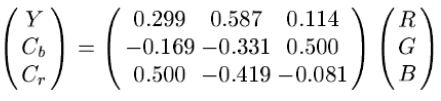

Chrominance infomation can be reduced without significant visual loss.
Downsample Cb and Cr by a factor of 2 along each axis.

#### Frequency domain
Instead of thinking spatially in terms of pixels, we instead think of the frequency and amplitude of intensity changes.

The human visual system is very good at perceiving changes in low frequency information but not high frequency - therefore: crush the highs and let the lows will survive.

#### DCT - Discrete Cosine Transform
DCT converts absolute values into amplitudes of frequency bands.

Images are split into 8x8 blocks and DCT is applied to each block.

- A level shift is applied to transform the 0-255 range into -128-127
- since images are 2d, 2d DCT is used.

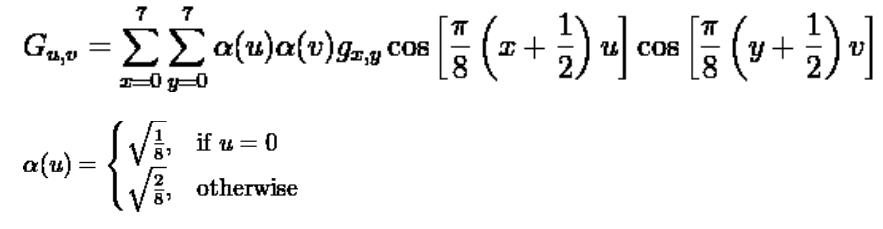
-	G<sub>u,v</sub> is the DCT coefficient at (u,v)
-	g<sub>x,y</sub> is the pixel value at (x,y)

DCT transform coefficients:
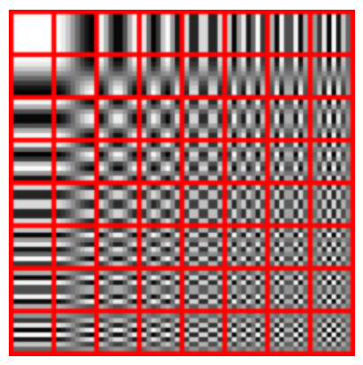

Each cell represents the frequency the coefficient at that location represents
- top-left: DC coefficient
- others: AC coefficients

##### Examples
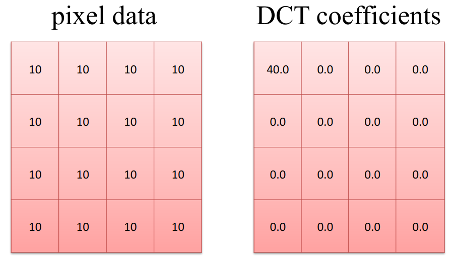
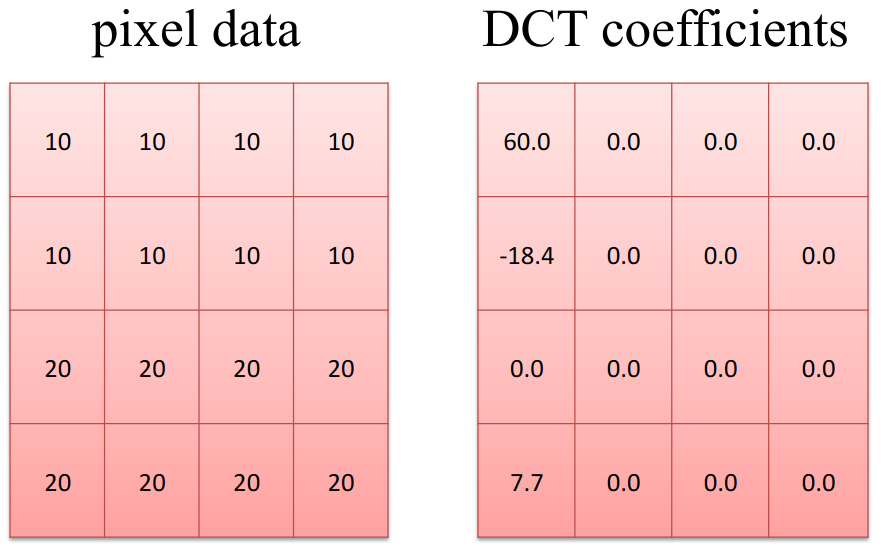
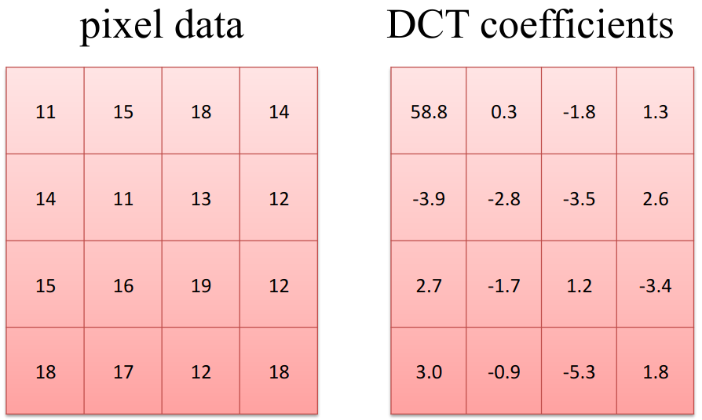

#### Quantisation
the process of constraining a large number to a small number by rounding

<center><code>y = round(V/q)</code></center><br/>
where: V is the original and q is the quantisation factor.

Multiplying the result by q obtains a value close to the original.

`round(53 / 10) * 10 ≈ 53`

**This process is lossy**

- JPEG has 2 quantisation tables.
	- luminance
	- chrominance
- These tables define quantisation factors for each of the 8x8 DCT coefficients.
	- Higher values for higher frequencies

These quantisation factors are scaled by a quality factor (q factor) between 1-100. This gives the user control of **quality vs file size**.

> Slide 32 contains an example of the tables. They are just large matricies of values. with the final quantised values one containing alot of 0s as the process are removed alot of data from the orginal .

> Slide 33 contains examples of jpeg images at different quality levels.
> Q=95 is pretty good
> Q=5 is nauseating


#### Entropy Compression
- DC values are differentially coded (difference to previous DC value).
- These differences are stored as two components:
	- the DC code which states how many bits are going to follow (different ranges of differences)
	- the actual DC difference (within the range)
- The DC codes are entropy coded using Huffman.
	- A standard huffman table is supplied by the JPEG group, but this can be optimised.

> JPEG table shown on slide 35.
> 36 contains an example of compressing a value with the table.

- AC coefficients are stored in a zig-zag fashion.
- coefficients towards the lower right are more likely to be 0s after quantisation
- storing coefficients in this order increases the likelihood of having long runs of 0s
<br/>
- two components for each non-zero AC coefficient:
	- the number of preceding zeros followed by the size of the AC value.
	  - The combination of these two is Huffman encoded using a separate Huffman table for AC values which has up to 250 possible values.
	  - These are special Huffman codes that allow early termination of a block (i.e all remaining ACs=0)
	- The data for the actual AC value


#### Summary
1. Convert image into YCbCr
2. downsample CbCr channels (optional)
3. chunk image into 8x8 blocks (each channel separately)
4. apply DCT on each block
5. Quantise DCT coefficients using the quantisation tables and the chosen quality factor
6. Differental coding of DC data followed by Huffman coding
7. Runlength coding of AC data followed by Huffman coding

#### Decompression

Decompression is just the reverse
- Entropy data is read in and entropy decoded
- coefficients are de-quantised
- inverse DCT performed
- unsampling and color space conversion

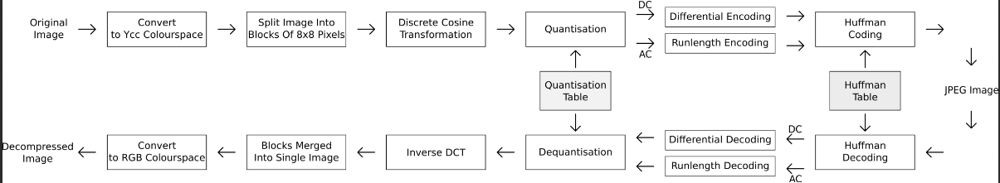


#### Compression vs Retieval
- Images must be compressed due to limited disk space
- Most CBIR techniques operate in the uncompressed pixel domain
- during the query images need to be decompressed
- feature vectors are stored alongside the images

Techniques that can operate directly on compressed images are needed:
- **Midstream content access**
- more efficient
- less demanding on resources

Two possibilties:
- Algorithms that operate on pre-existing compressed formats (like JPEG)
- New compression methods which meet 'the fourth criterion'

> The fourth criterion is "4. Content access work"
> it is a measure of how much work is needed to be done to actually access the data. I think. Its all in this [Paper](http://hd.media.mit.edu/tech-reports/TR-295.ps.Z).

#### JPEG CBIR
Compressed-domain CBIR for JPEG operates on the DCT coefficients.
Meaning the huffman stuff and quantisation needs to be reversed but not the DCT.
The DCT operation is the most time consuming part.

**color histogram**
- DC component represents the average color for the entire 8x8 block of pixels
- using only DC term gives a downsampled version of the image
- this can be used to directly build a color histogram by building a histogram of DC terms

**texture descriptors**
- The AC coefficients represent the variance of pixels across the block.
- Tecture descriptors can be build directly using the first few AC coefficients.

**Edge descriptors**
- Edge information is stored from the coefficients representing vertical, horizonal, or diagonal infomation.
- thises coefficents can be directly exploted for feature calculation.

### Summary
- Compression fundamentals:
 - runlength coding
 - differential coding
 - predicitve coding
 - entropy (Huffman) coding
- PNG compression
	- lossless
	- predictive coding + entropy coding
- JPEG compression
	- lossless
	- DCT + quantisation + entropy coding
- JPEF compressed domain CBIR
	-	color - texture	- shape
